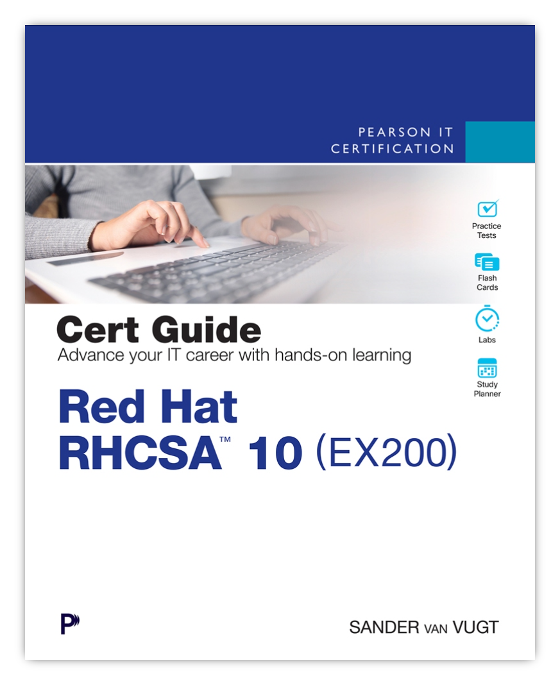
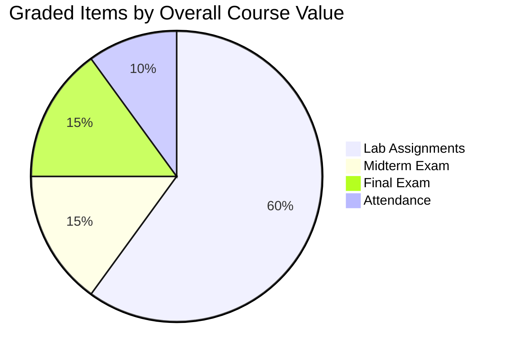
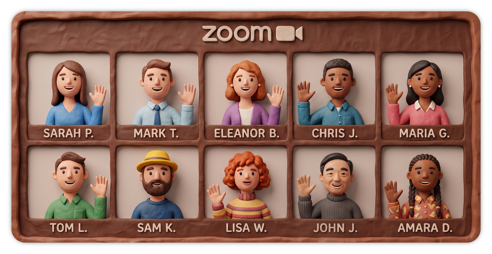

# IT-230

## Course Introduction

---
layout: two-cols-header
horizontal: center
vertical: center
---

# Sean Twiehaus

::left::

- Tech Lead Software Engineer
- <AccentText>RHCSA Certified</AccentText> (RHEL 7 and 9)
- <AccentText>RHCE Certified</AccentText> (RHEL 10)

::right::

- 20 years in the IT industry
- 15 years in Ops:
  - Field Service Agent
  - Windows Administrator
  - Linux Systems Administrator
  - Automation Engineer
- 5 years in Dev:
  - Full Stack Software Engineer
  - Tech Lead
- <AccentText>First Learned Linux in 2014 as SCC</AccentText>

---
---

# Introduction (Preview)

## What is your name and study program?

### *(Administration, DevOps, Cybersecurity, Programming)*

<AccentText normal>Sean Twiehaus — Administration</AccentText>

 

## Do you have any experience with Linux outside of class?

<AccentText normal>Using Linux daily since 2014, professionally and personally (homelab)</AccentText>

 

## Do you plan to take the RHCSA Exam?

<AccentText normal>Yes</AccentText>

---
listSpacing: padded
---

# SCC Linux Courses

## IT-130 — Intro to Linux ✅

- First half of Red Hat Certified System Administrator (RHCSA) exam preparation.
- Red Hat Academy course: RH124
- Red Hat Enterprise Linux version 9.3

## IT-230 — Linux Administration 😎

- Second half of Red Hat Certified System Administrator (RHCSA) exam preparation.
- Red Hat Academy course: RH134
- Red Hat Enterprise Linux version 10.0

<!--
Ask: tell me one thing you remember about Intro to Linux.
-->

---
listSpacing: padded
---

# Red Hat Enterprise Linux (RHEL) 10

- Released May 20th, 2025
- Red Hat Academy updated its material November 2025
    - Added course sections for new features
        - Flatpaks
        - Image mode
- This course is on <AccentText>RHEL 10.0</AccentText>; Intro to Linux was on RHEL 9.3
- <AccentText>They are about 98% the same</AccentText>
- When signing up for the RHCSA exam, you can choose version 9 or 10

---
listSpacing: padded
---

# Red Hat Certified Systems Administrator (RHCSA) Exam

- Normally $500
- Includes one <AccentText italic>free</AccentText> retake
- You will receive a <AccentText italic>50% discount</AccentText> voucher
- Hands-on, task-based

<Callout title="Example RHCSA task">

Create users *jane* and *john* and make them members of the *admins* group as a secondary group membership.

</Callout>

---
layout: two-cols-header
vertical: center
---

# RHCSA Cert Guide

::left::

[Red Hat RHCSA 10 Cert Guide: EX200](https://www.pearsonitcertification.com/store/red-hat-rhcsa-10-cert-guide-ex200-9780135576663?ranMID=24808)

By: [*Sander van Vugt*](https://www.sandervanvugt.com/)

Published by Pearson IT Certification

ISBN-10: 0-13-557666-0

ISBN-13: 978-0-13-557666-3

::right::

<!--
Ask: who is planning to take the RHCSA?
-->

---
layout: center
---

# Effortful practice is required to *pass* the
# <AccentText>RHCSA Exam</AccentText>

---
layout: center
---

# Effortful practice is required to *learn*
# <AccentText>Linux Administration</AccentText>

---
listSpacing: padded
---

# Four Learning Opportunities Each Week

## Before class

1. Read the Red Hat Academy material and practice the Guided Exercises

## During class

2. I will show the material (presentations and demonstrations)
3. We will work through in-class exercises

## After class

4. Complete graded lab assignments

---

# AI Is a Tool

## IT workers are being encouraged to use AI
## It isn't prudent to prohibit students from using AI
## Realize <AccentText>AI is a tool</AccentText>
## Tools can be used positively or negatively

---
layout: two-cols-header
vertical: center
---

# AI Usage

::left::

## Negative Use

Replaces or diminishes effortful practice

<Callout type="danger" title="Example">

Asking AI to do your homework for you

</Callout>

::right::

## Positive Use

Enables more effortful practice

<Callout type="success" title="Example">

Writing a detailed prompt when you are stuck

</Callout>

<!--
Positive-use story: a student is stuck and cannot or will not continue effortful
practice. Instead of emailing a classmate, the professor, or waiting for office
hours, they use AI and get "unstuck" so they are able to perform more effortful practice.
-->

---
---

# AI Guidelines

## Treat AI like a classmate

#### <SuccessText>Do</SuccessText> ask AI for specific help when you are stuck

#### Do <DangerText>NOT</DangerText> ask AI do your homework for you

<Callout type="danger">

## <DangerText>Use of AI is prohibited on all exams</DangerText>

</Callout>

---
layout: two-cols-header
---

# Grades

## Emphasis on hands-on work, just like the RH exams!

 

::left::

::right::

| Graded Items    | Overall Course Value |
|-----------------|----------------------|
| Lab Assignments | 60%                  |
| Midterm Exam    | 15%                  |
| Final Exam      | 15%                  |
| Attendance      | 10%                  |

---
layout: two-cols-header
vertical: evenly
---

# IT-230 Exams

::left::

<Callout type="warning" title="Very Challenging">

Essentially shortened RHCSA practice exams

</Callout>

- Taken in the <AccentText>SCC Lab</AccentText> environment
- <AccentText>Open "book"</AccentText>
  - Red Hat Academy website
- <AccentText>Open notes</AccentText>
  - Hand-written or hand-typed notes only

<Callout type="danger">

No other website, material, or resource is allowed

</Callout>

::right::

---
---

# Late Policy

- Assignments are due the <AccentText>following Tuesday at 11:59 p.m.</AccentText>
- Late work is accepted for up to two weeks after the due date
  - <AccentText>20% is deducted from every late assignment</AccentText>
- Two weeks after the due date, assignments lock
- <AccentText>Once assignments are locked, submissions are disabled</AccentText>
- All assignments must be submitted before the final exam

## Example

- Today assignments are given
- Next Tuesday at 11:59 p.m. assignments are due
- Two weeks after they are due, assignments lock

---
layout: center
---

# <AccentText>10 minute break</AccentText> every <AccentText>50 minutes</AccentText>.

## First break: <AccentText>6:50 p.m.</AccentText>

## Second break: <AccentText>7:50 p.m.</AccentText>

<!-- Please remind me if I forget! -->

---
layout: center
---

# <AccentText> Cameras On During Class</AccentText>

## Except between first and second break

---
layout: center
---

# Office Hours

## <AccentText>Mondays 7p.m. to 8p.m. central time</AccentText>

*Except during holidays and breaks*

---
---

# Between Classes

## 1. Turn in Lab assignments

## 2. Read the next chapter and practice the Guided Exercises

---
---

# Introduction

## What is your name and study program?
### (Administration, DevOps, Cybersecurity, Programming)

## Do you have any experience with Linux outside of class?

 

## Do you plan to take the RHCSA Exam?
