# Accessing the Lab Environments

## Console, Terminal, Shell

---
layout: two-cols-header
---

# IT-230 Lab Environments

## <AccentText normal>Two lab environments with nearly identical configurations</AccentText>

::left::

## RHA Lab

- Used for Guided Exercises and RHA Labs
- Hosted on the <AccentText>Red Hat Academy</AccentText> website
- Uses Linux virtualization

## SCC Lab

- Used for in-class exercises and SCC labs
- Hosted on the <AccentText>SCC VDI</AccentText>
- Uses VirtualBox

::right::

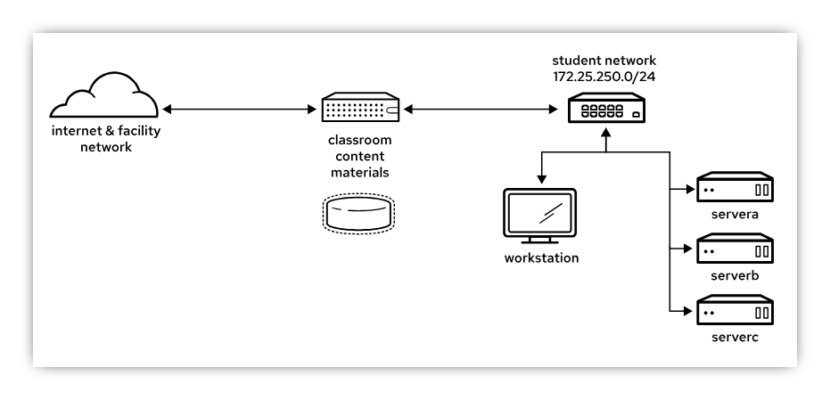

---
---

# IT-230 Lab Environments

## Admin user

- **User**: `student`
- **Password**: `student`
- Allowed to SSH and use `sudo`

## Super user

- **User**: `root`
- **Password**: `redhat`
- Allowed to SSH

| Name        | IP            | System type | CPU | Memory (MB) | Disks (thin provisioned)       |
| ----------- | ------------- | ----------- | --- | ------------ | ------------------------------- |
| workstation | 172.25.250.9  | Graphical   | 2   | 4096         | 1 × 20GB (OS)                   |
| servera     | 172.25.250.10 | Headless    | 1   | 2048         | 1 × 10GB (OS), 3 × 5GB (blank)  |
| serverb     | 172.25.250.11 | Headless    | 1   | 2048         | 1 × 10GB (OS), 3 × 5GB (blank)  |
| serverc     | 172.25.250.12 | Headless    | 1   | 2048         | 1 × 10GB (OS), 3 × 5GB (blank)  |

---
horizontal: center
---

## Links to both lab environments on the course home page

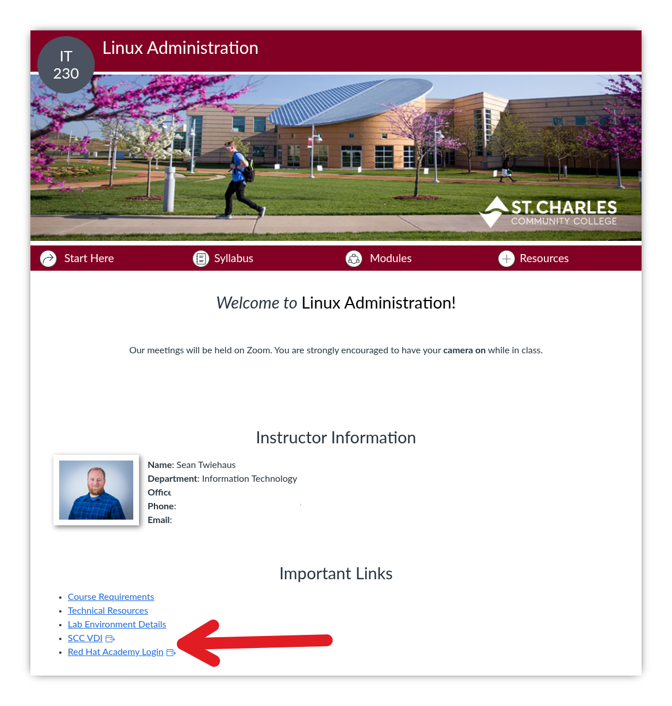

---
layout: section
---

# Accessing the RHA Lab

---
layout: two-cols-header
vertical: center
listSpacing: padded
leftWidth: 55
---

# Create Lab Environment

::left::

1. Click the `Lab Environment` tab.
2. Click the `Create` button

<Callout type="warning">

### You have **60 hours of RHA lab time**

#### Stop your VMs when you are not using them

</Callout>

::right::

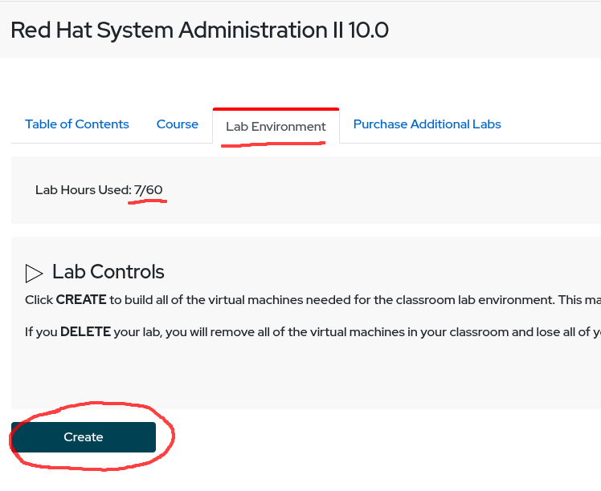

<!-- Have the students click 'Create' -->

---
layout: section
---

# Terminology

## Console, Terminal, Shell

---
layout: two-cols-header
horizontal: center
---

# Console

## What you see when you look at the screen of a Linux server

::left::

## Graphical console

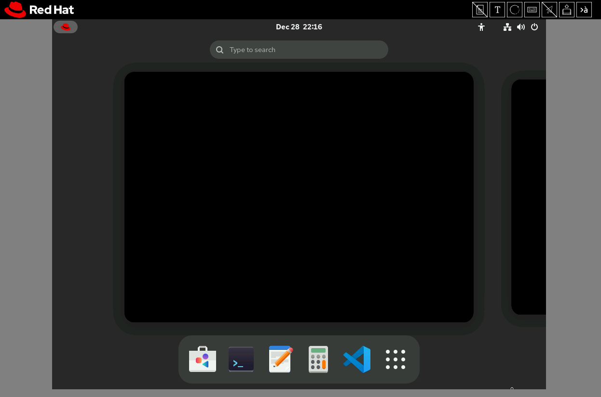

`workstation`

::right::

## Text console

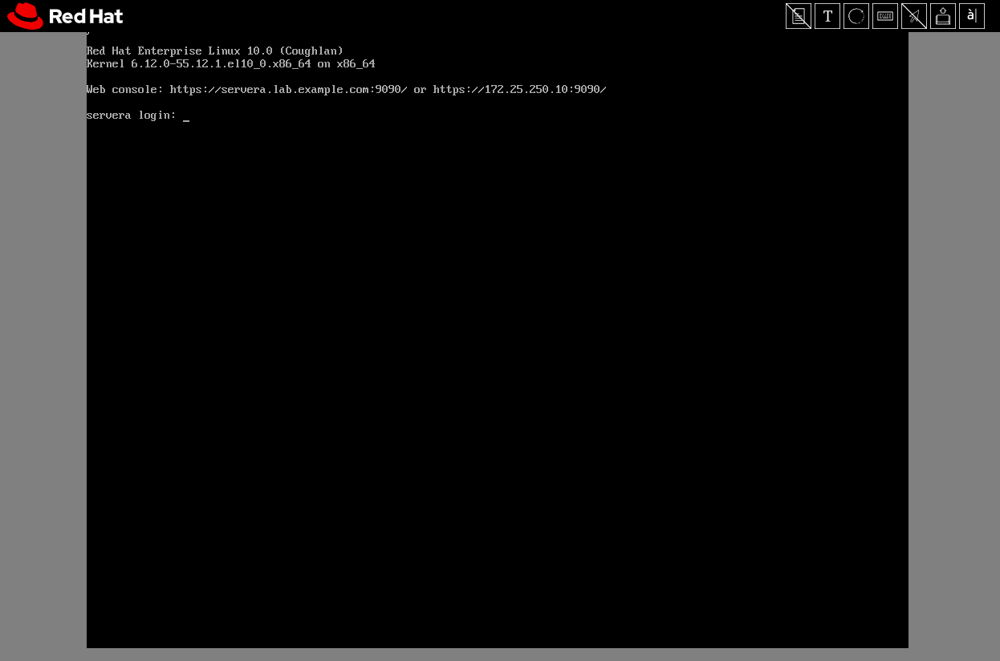

`servera`, `serverb`, `serverc`

---
layout: two-cols-header
horizontal: center
---

# Terminal

## Opened on the console, provides access to shells

::left::

### Terminal on a graphical console

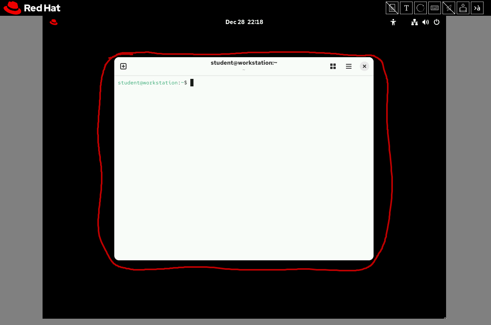

The terminal is an application

::right::

### Terminal on a text console

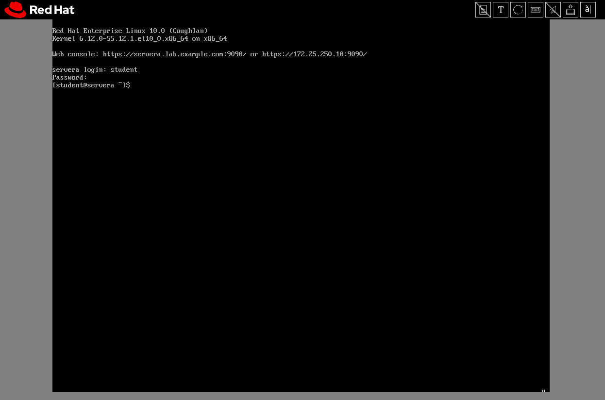

Terminal and console are basically the same.

---
layout: two-cols-header
vertical: center
listSpacing: padded
leftWidth: 45
---

# Shell (Bash, Zsh, Fish...)

## The interpreter running inside the terminal

::left::

- The shell interprets your commands
- Bash is the default shell on RHEL

::right::

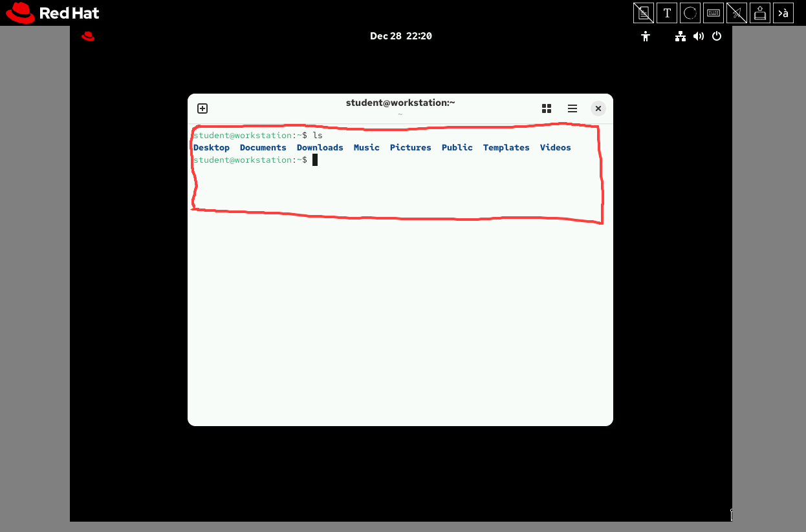

---
layout: two-cols-header
vertical: center
---

# Opening RHA Lab Consoles

### Click the `Open Console` button next to the machine you want to access.

::left::

The environment will autostop after an hour

The environment will delete after 7 days

<Callout>

Use the `+` button to extend, if needed.

</Callout>

::right::

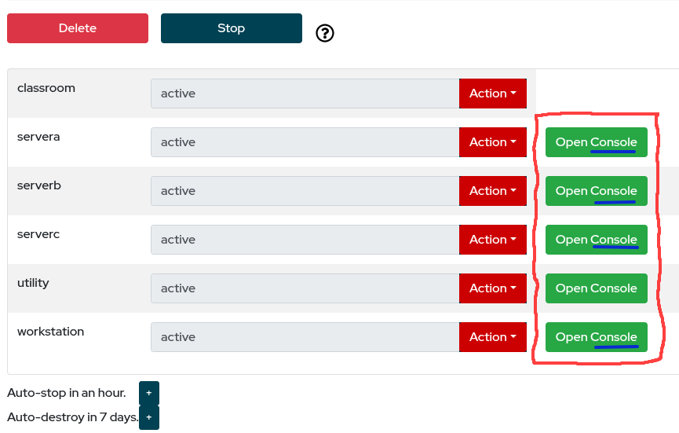

---
layout: two-cols-header
horizontal: center
---

# Console — RHA Lab

::left::

## Graphical console

::right::

## Text console

---
layout: two-cols-header
listSpacing: padded
---

# Console Controls

::left::

1. Enable Host Paste
   - Allows you to use Ctrl+V to paste text
2. Open Text Dialogue
   - Opens a text input you can paste text into
3. Ctrl+Alt+Delete
4. On-screen keyboard

::right::

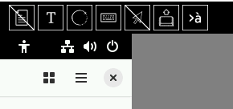

---
---

# Exercise: Accessing RHA Lab Environment

---
layout: section
---

# Accessing the SCC Lab

---
layout: two-cols-header
listSpacing: padded
---

# SCC Lab

## Hosted on SCC's Virtual Desktop Infrastructure (VDI)

::left::

- Data is <AccentText>NOT</AccentText> persisted
- VM changes are <AccentText>NOT</AccentText> persisted
- Kicked if inactive
- Sessions held open for an hour
- After that, progress will be wiped

::right::

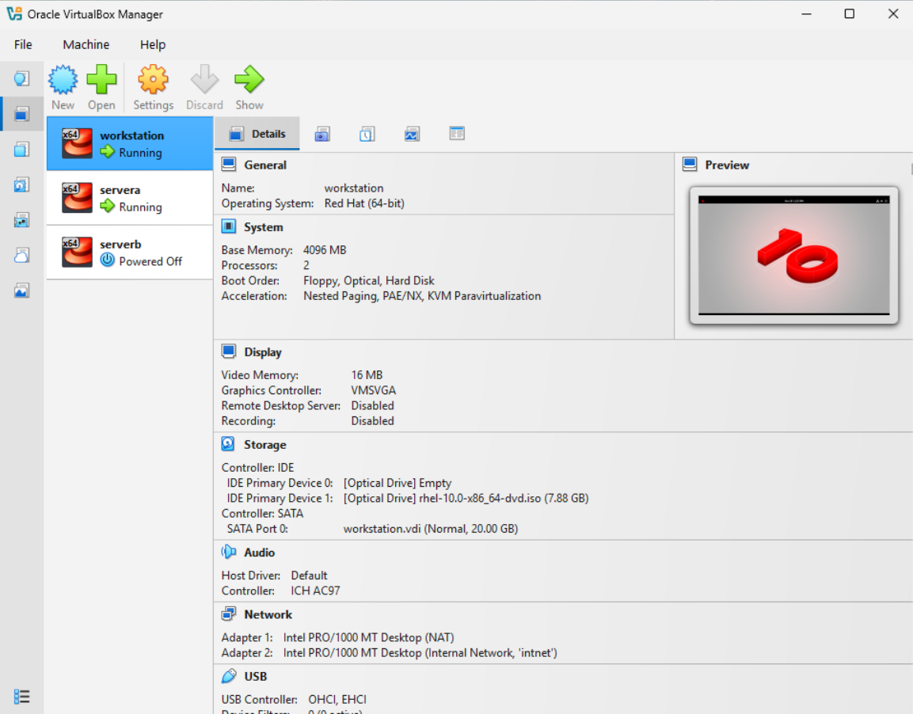

---
layout: two-cols-header
horizontal: center
---

# Console — SCC Lab

::left::

## Graphical console

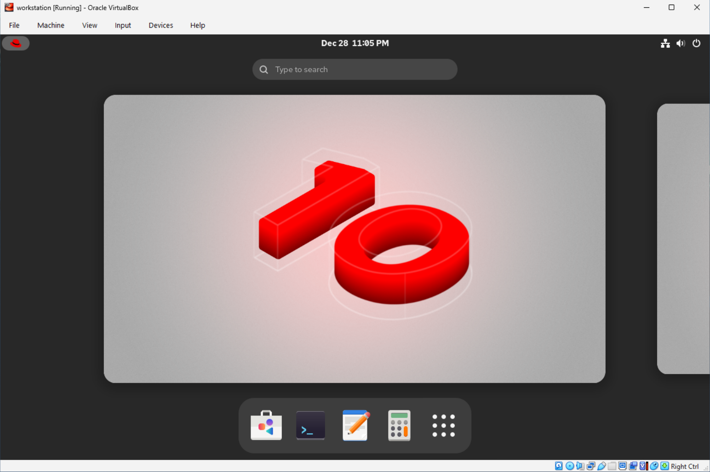

::right::

## Text console

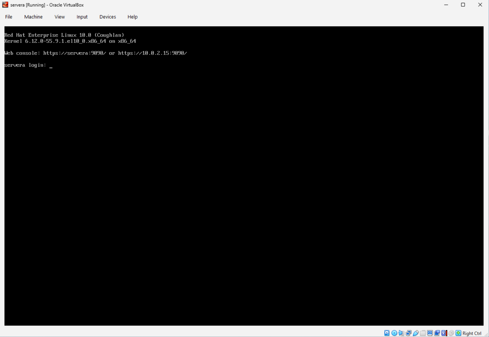

---
layout: two-cols-header
leftWidth: 40
---

# SSH — SCC Lab

## SCC lab allows <AccentText>SSH</AccentText> from <AccentText>Windows Terminal</AccentText> in the VDI

1. Start the virtual machine(s) you want to access using VirtualBox.
2. Open the <AccentText>Windows Terminal</AccentText> application and type `ssh {VM_NAME}`

::left::

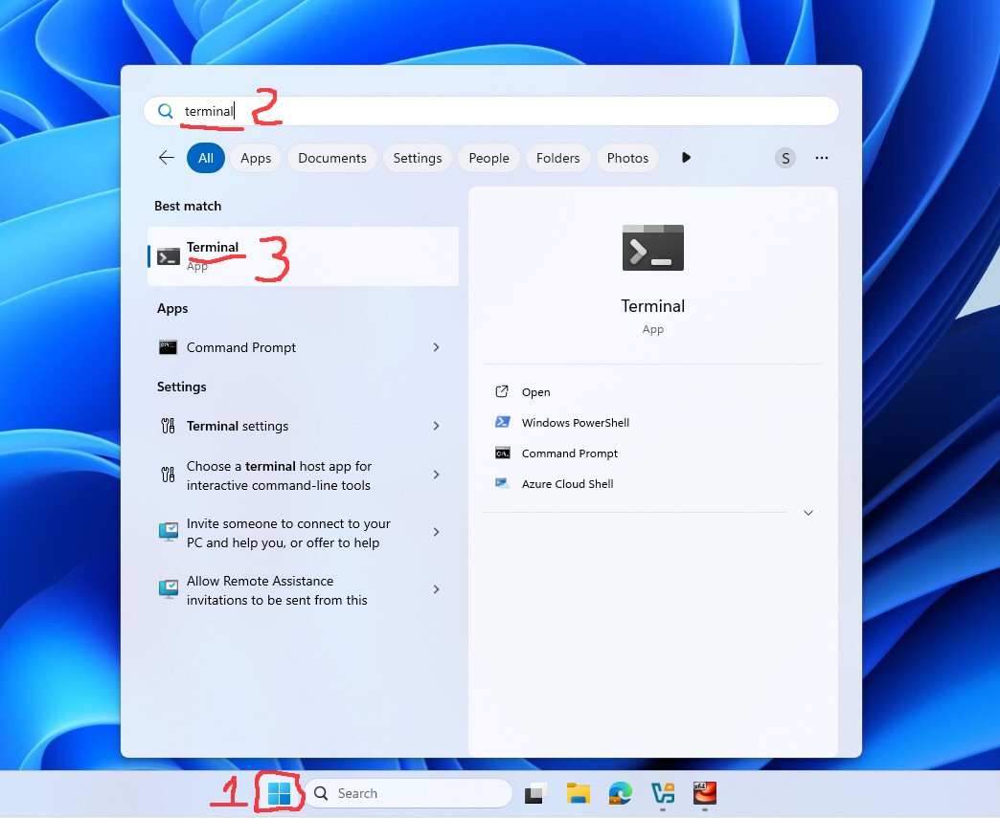

::right::

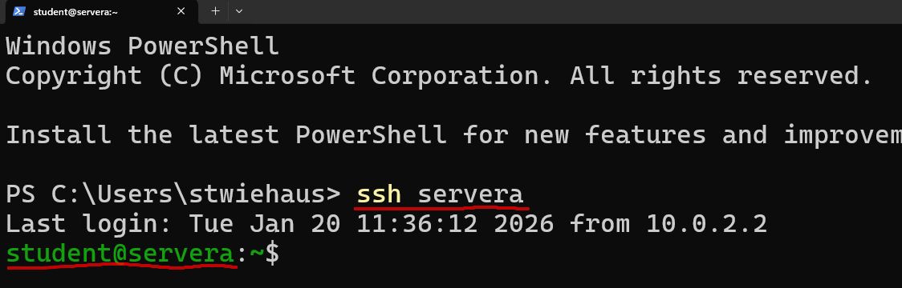

<!-- This is the most similar to how you will access Linux systems in a work environment -->

---
---

# Exercise: Accessing the SCC Lab Environment
