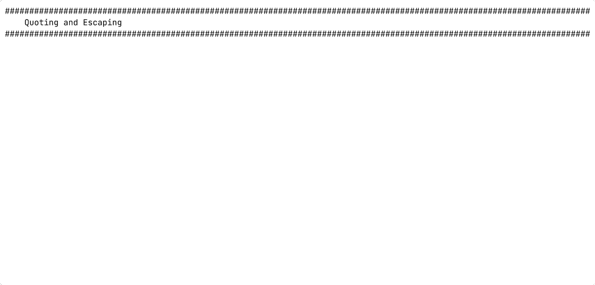

# Shell Expansions

## Matching file names before commands run

---
vertical: center
---

# Bash Reads Your Command First

You type a command. <AccentText>Bash reads it before anything runs.</AccentText>

Characters such as `*`, `?`, and `[` mean something <DangerText>to Bash</DangerText>.

When Bash sees them in a command line:

- It searches the file system for matching names
- It replaces the pattern with matching file names
- It hands the expanded list to the command

---
vertical: evenly
---

# Pathname Expansion

Bash replaces a pattern with the names of the files that match it, <AccentText>before</AccentText> running the command.

<TerminalWindow title="student@servera:~">

````md magic-move
```bash-session
student@servera:~$ ls
filea.txt  fileb.md  filec.sh
student@servera:~$ echo *
```
```bash-session
student@servera:~$ ls
filea.txt  fileb.md  filec.sh
student@servera:~$ echo *
filea.txt fileb.md filec.sh
student@servera:~$
```
````

</TerminalWindow>

<v-click>

`echo` never received a `*`. It received three file names.

This is called <AccentText>globbing</AccentText>.

</v-click>

---
layout: two-cols-header
vertical: start
---

# The Three Glob Patterns

::left::

| Pattern | Matches                          |
| ------- | -------------------------------- |
| `*`     | any run of characters, including none |
| `?`     | exactly one character            |
| `[ab]`  | one character from the set       |

A glob matches <AccentText>whole file names</AccentText>, so `*.txt` means "anything, then `.txt`".

::right::

<TerminalWindow title="student@servera:~">

```bash-session
student@servera:~$ ls
filea.txt  fileb.md  filec.sh
student@servera:~$ ls *.txt
filea.txt
student@servera:~$ ls file?.md
fileb.md
student@servera:~$ ls file[ac].*
filea.txt  filec.sh
student@servera:~$
```

</TerminalWindow>

---

# Exercise: Shell Expansions

## Requirements

Host: `servera`

Create three files with different names and extensions to match against.

## Steps

1. Create test files `filea.txt`, `fileb.md`, and `filec.sh` on `servera`
2. List your files using a pattern that matches only one of the extensions
3. List them again using a pattern that matches exactly one character in the name
4. List them a third time using a pattern that matches a set of characters
5. Show what Bash does to an unquoted `*` with `echo *`

---

# Exercise: Shell Expansions



<a href="https://asciinema.org/a/772135" target="_blank" rel="noopener noreferrer" aria-label="Watch the Shell Expansions recording in a new tab">Watch the recording</a> · <a href="../resources/shell-expansions-exercise.html" target="_blank" rel="noopener noreferrer" aria-label="Read the written Shell Expansions exercise in a new tab">Read the written exercise</a>
