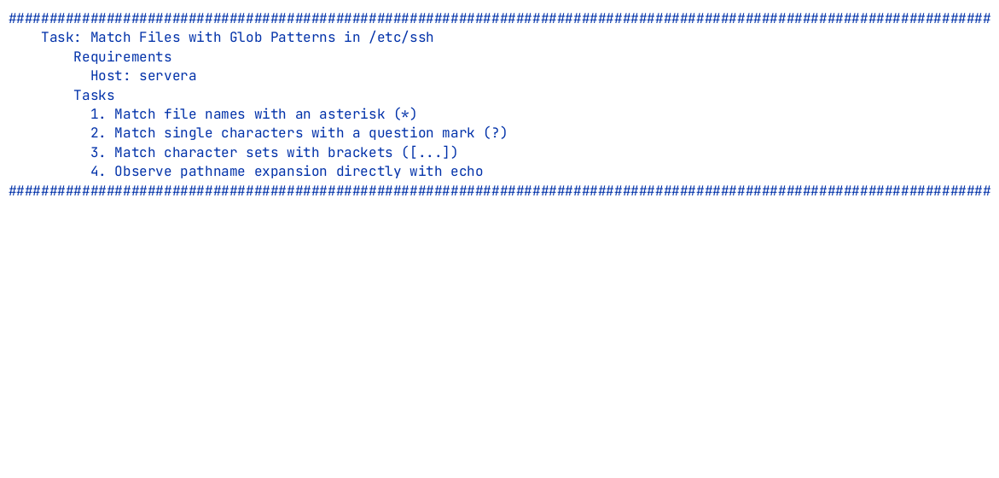

# Shell Expansions

## Matching file names before commands run

---
vertical: center
listSpacing: padded
---

# Bash Is an Interpreter

You type a command. <AccentText>Bash reads it before anything runs.</AccentText>

Characters such as `*`, `?`, and `[` mean something <DangerText>to Bash</DangerText>.

When Bash sees them in a command line:

- It searches the file system for matching names
- It replaces the pattern with matching file names
- It hands the expanded list to the command

---
vertical: evenly
---

# Pathname Expansion

Bash replaces a pattern with the names of the files that match it, <AccentText>before</AccentText> running the command.

<TerminalWindow title="student@servera:~">

````md magic-move
```bash-session
student@servera:~$ ls
filea.txt  fileb.md  filec.sh
student@servera:~$ echo *
```
```bash-session
student@servera:~$ ls
filea.txt  fileb.md  filec.sh
student@servera:~$ echo *
filea.txt fileb.md filec.sh
student@servera:~$
```
````

</TerminalWindow>

<v-click>

`echo` never received a `*`. It received three file names.

This is called <AccentText>globbing</AccentText>.

</v-click>

---
---

# Match Any Characters: `*`

`*` matches <AccentText>any number of characters</AccentText>, including none

<TerminalWindow title="student@servera:~">

````md magic-move
```bash-session
student@servera:~$ ls
filea.txt  fileb.md  filec.sh
student@servera:~$ ls *.txt
```
```bash-session
student@servera:~$ ls
filea.txt  fileb.md  filec.sh
student@servera:~$ ls *.txt
filea.txt
student@servera:~$
```
````

</TerminalWindow>

<v-click>

A glob matches whole file names, so `*.txt` means "anything, then `.txt`"

</v-click>

---
---

# Match Any Characters: `*`

<TerminalWindow title="student@servera:~">

````md magic-move
```bash-session
student@servera:~$ ls
filea.txt  fileb.md  filec.sh
student@servera:~$ ls file*
```
```bash-session
student@servera:~$ ls
filea.txt  fileb.md  filec.sh
student@servera:~$ ls file*
filea.txt  fileb.md  filec.sh
```
````

</TerminalWindow>

<v-click>

A glob matches whole file names, so `file*` means "`file` then anything"

</v-click>

---
---

# Match Exactly One Character: `?`

`?` matches <AccentText>exactly one character</AccentText>


<TerminalWindow title="student@servera:~">

````md magic-move
```bash-session
student@servera:~$ ls
filea.txt  fileb.md  filec.sh
student@servera:~$ ls file?.md
```
```bash-session
student@servera:~$ ls
filea.txt  fileb.md  filec.sh
student@servera:~$ ls file?.md
fileb.md
student@servera:~$
```
````

</TerminalWindow>

<v-click>

`file?.md` matches `fileb.md`, but will not match `file.md` or `file10.md`.

</v-click>

---
---

# Match Exactly One Character: `?`

<TerminalWindow title="student@servera:~">

````md magic-move
```bash-session
student@servera:~$ ls
filea.txt  fileb.md  filec.sh
student@servera:~$ ls file?.*
```
```bash-session
student@servera:~$ ls
filea.txt  fileb.md  filec.sh
student@servera:~$ ls file?.*
filea.txt  fileb.md  filec.sh
```
````

</TerminalWindow>

<v-click>

`file?.*` matches:

- `file`
- Followed by one character
- Followed by a dot
- Followed by anything

</v-click>

---
---

# Match a Set of Characters: `[...]`

`[...]` matches <AccentText>one character from the set</AccentText> listed inside the brackets.


<TerminalWindow title="student@servera:~">

````md magic-move
```bash-session
student@servera:~$ ls
filea.txt  fileb.md  filec.sh
student@servera:~$ ls file[ac].*
```
```bash-session
student@servera:~$ ls
filea.txt  fileb.md  filec.sh
student@servera:~$ ls file[ac].*
filea.txt  filec.sh
student@servera:~$
```
````

</TerminalWindow>

<v-click>

`file[ac].*` matches `filea` or `filec` followed by any extension, but ignores `fileb.md`.

</v-click>

---
---

# Match a Set of Characters: `[...]`

<TerminalWindow title="student@servera:~">

````md magic-move
```bash-session
student@servera:~$ ls
filea.txt  fileb.md  filec.sh
student@servera:~$ ls file[ab].*
```
```bash-session
student@servera:~$ ls
filea.txt  fileb.md  filec.sh
student@servera:~$ ls file[ab].*
filea.txt  fileb.md
student@servera:~$
```
````

</TerminalWindow>

<v-click>

`file[ab].*` matches:
- `filea` or `fileb`
- Followed by a dot
- Followed by anything

</v-click>

---
layout: two-cols-header
vertical: center
---

# The Three Glob Patterns

::left::

| Pattern | Matches                               |
|---------|---------------------------------------|
| `*`     | any run of characters, including none |
| `?`     | exactly one character                 |
| `[ab]`  | one character from the set            |

::right::

<TerminalWindow title="student@servera:~">

```bash-session
student@servera:~$ ls
filea.txt  fileb.md  filec.sh
student@servera:~$ ls *.txt
filea.txt
student@servera:~$ ls file?.md
fileb.md
student@servera:~$ ls file[ac].*
filea.txt  filec.sh
student@servera:~$
```

</TerminalWindow>

---
layout: exercise
---

# Shell Expansions

::goal::

Match pathnames with Bash wildcard patterns and observe the resulting expansion

::environment::

**Host:** `servera`

::workflow::

1. Match file names with an asterisk (`*`)
2. Match single characters with a question mark (`?`)
3. Match character sets with brackets (`[...]`)
4. Observe pathname expansion directly with `echo`

---
layout: exercise
variant: recording
---

# Shell Expansions

::recording::



::resources::

<a href="https://asciinema.org/a/1263845" target="_blank" rel="noopener noreferrer" aria-label="Watch the Shell Expansions recording in a new tab">Asciinema recording</a><a href="../resources/shell-expansions-exercise.html" target="_blank" rel="noopener noreferrer" aria-label="Read the written Shell Expansions exercise in a new tab">Written exercise</a>
