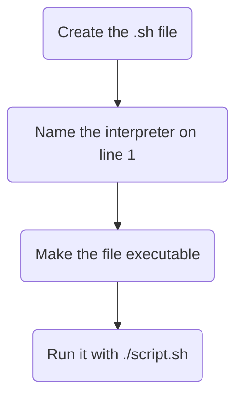

# Bash Scripts

## Commands in a squence

---
layout: two-cols-header
leftWidth: 45
---

# Refresher: `.` and `..`

Where does each file end up?

::left::

<TerminalWindow title="student@servera:~">

```bash-session
student@servera:~$ cd ~/bin
student@servera:~/bin$ mv ~/Downloads/engager.sh .
```

</TerminalWindow>

<v-click>

`.` is the directory I am **in** → `~/bin`

</v-click>

::right::

<TerminalWindow title="student@servera:~/bin">

```bash-session
student@servera:~/bin$ pwd
/home/student/bin
student@servera:~/bin$ mv engager.sh ..
```

</TerminalWindow>

<v-click>

`..` is the directory **above** it → `/home/student`

</v-click>

---
layout: two-cols-header
leftWidth: 25
---

# A Script Is Just Commands in a File

::left::



::right::

```bash [take_inventory.sh]
#!/bin/bash
echo "Taking inventory"
ls > inventory
```

Line 1 is the <AccentText>hashbang</AccentText> `#!`

It tells the kernel which interpreter should read the rest of the file

The remaining lines are commands that will be ran one after the other

---

# Running a Shell Script

<TerminalWindow title="student@servera:~/scripts">

````md magic-move
```bash-session
student@servera:~/scripts$ vim take_inventory.sh
student@servera:~/scripts$ bash take_inventory.sh
Taking inventory
student@servera:~/scripts$
```
```bash-session
student@servera:~/scripts$ vim take_inventory.sh
student@servera:~/scripts$ bash take_inventory.sh
Taking inventory
student@servera:~/scripts$ ./take_inventory.sh
-bash: ./take_inventory.sh: Permission denied
student@servera:~/scripts$
```
```bash-session
student@servera:~/scripts$ vim take_inventory.sh
student@servera:~/scripts$ bash take_inventory.sh
Taking inventory
student@servera:~/scripts$ ./take_inventory.sh
-bash: ./take_inventory.sh: Permission denied
student@servera:~/scripts$ chmod a+x take_inventory.sh
student@servera:~/scripts$ ./take_inventory.sh
Taking inventory
student@servera:~/scripts$
```
````

</TerminalWindow>

`bash script.sh` runs it without the execute bit. `./script.sh` requires it

---
vertical: center
---

# Why Doesn't It Run by Name?

<v-switch at="0">

<template #0-2>

It is executable, and it is right there in your home directory

<TerminalWindow title="student@servera:~" :rows="12">

````md magic-move
```bash-session
#^ 1. Executable, but not found
student@servera:~$ ls -l take_inventory.sh
-rwxr-xr-x. 1 student student 51 Aug 28 10:52 take_inventory.sh
```
```bash-session {4,5}
#^ 1. Executable, but not found
student@servera:~$ ls -l take_inventory.sh
-rwxr-xr-x. 1 student student 51 Aug 28 10:52 take_inventory.sh
student@servera:~$ take_inventory.sh
-bash: take_inventory.sh: command not found
```
````

</TerminalWindow>

</template>

<template #2>

Bash only searches `PATH`, and your home directory is not on it

<TerminalWindow title="student@servera:~" :rows="9">

```bash-session {6,7,8}
#^ 1. Executable, but not found
student@servera:~$ ls -l take_inventory.sh
-rwxr-xr-x. 1 student student 51 Aug 28 10:52 take_inventory.sh
student@servera:~$ take_inventory.sh
-bash: take_inventory.sh: command not found
#^ 2. Where does Bash actually look?
student@servera:~$ echo $PATH
/home/student/.local/bin:...:/usr/sbin:/home/student/scripts
```

</TerminalWindow>

</template>

<template #3>

`~/scripts` is on the list, because you put it there this morning

<TerminalWindow title="student@servera:~" :rows="9">

```bash-session {9-12}
#^ 1. Executable, but not found
student@servera:~$ ls -l take_inventory.sh
-rwxr-xr-x. 1 student student 51 Aug 28 10:52 take_inventory.sh
student@servera:~$ take_inventory.sh
-bash: take_inventory.sh: command not found
#^ 2. Where does Bash actually look?
student@servera:~$ echo $PATH
/home/student/.local/bin:...:/usr/sbin:/home/student/scripts
#^ 3. Move it somewhere on the PATH
student@servera:~$ mv take_inventory.sh ~/scripts
student@servera:~$ take_inventory.sh
Taking inventory
```

</TerminalWindow>

</template>

</v-switch>

---
layout: center
---

# `./` says <AccentText>run the file at this path</AccentText>

# a bare name says <AccentText>go find it on `PATH`</AccentText>

---
layout: exercise
---

# Our First Bash Script

::goal::

Write a script, make it runnable, and get it to run by name from anywhere

::environment::

**Host:** `servera`

::workflow::

1. Write the script in your home directory with a hashbang
2. Try to run it, then add the execute permission
3. Run it with `./`
4. Find out why the bare name does not work
5. Move it onto your `PATH` and run it by name
