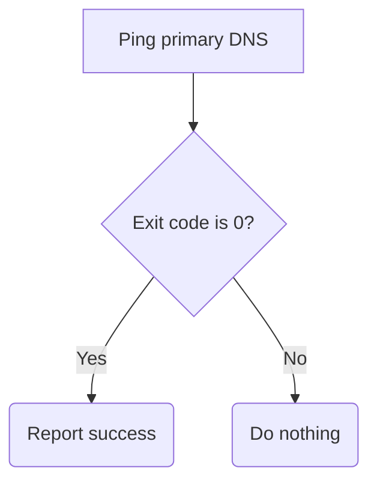
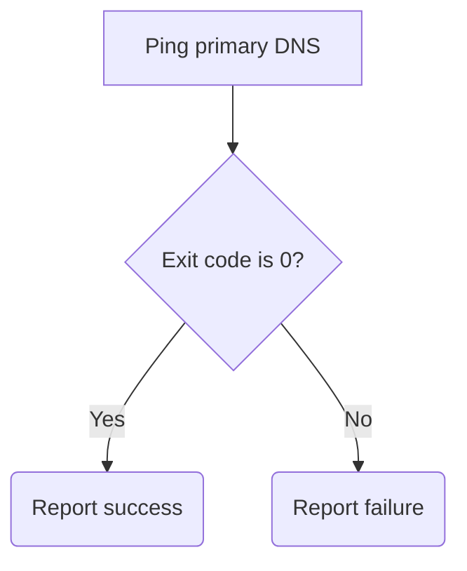
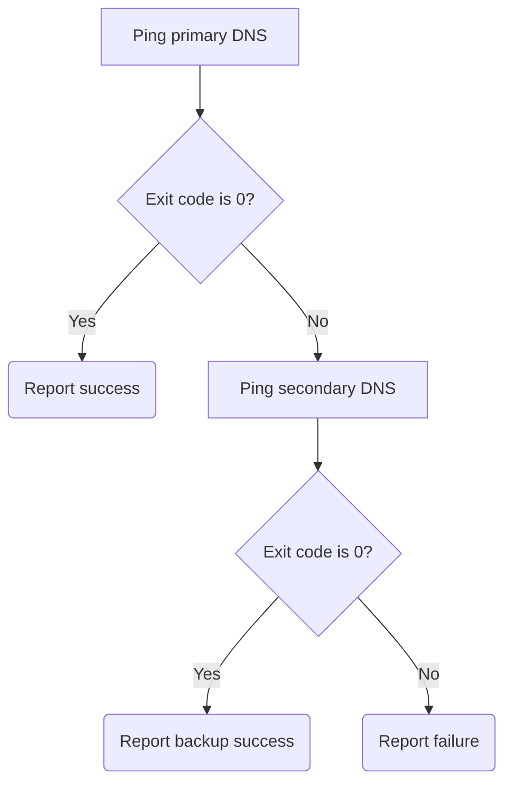
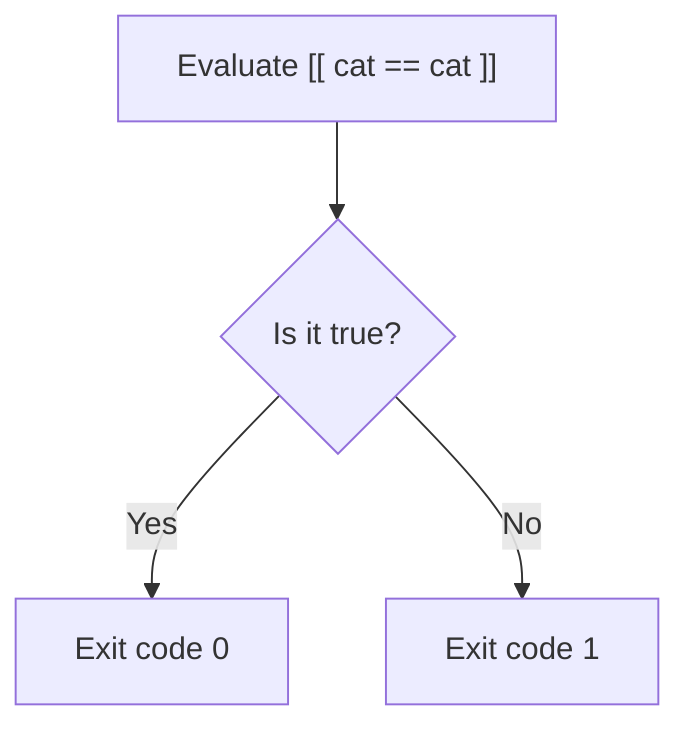

# Conditionals

## Teaching a script to make a decision

---
layout: two-cols-header
---

# Exit Codes

Every command reports whether it worked. The value is not printed, so ask for it with `$?`

::left::

## The numbers

- Range `0` to `255`
- `0` means <SuccessText>success</SuccessText>
- Above `0` means <DangerText>something went wrong</DangerText>

<TerminalWindow title="student@servera:~">

```bash-session
student@servera:~$ ping -c1 -W1 172.25.250.10
...
1 packets transmitted, 1 received, 0% packet loss
student@servera:~$ echo $?
0
```

</TerminalWindow>

::right::

## A failure

<TerminalWindow title="student@servera:~">

```bash-session
student@servera:~$ ping -c1 -W1 19.19.19.19
...
1 packets transmitted, 0 received, 100% packet loss
student@servera:~$ echo $?
1
```

</TerminalWindow>

---
layout: two-cols-header
leftWidth: 55
---

# `if` … `then`

The condition is a **command**, and its exit code is the answer

::left::

```bash
if <CONDITION>; then
    <STATEMENT>
fi
```

```bash
primary_dns='8.8.8.8'
if ping -c1 -W1 "$primary_dns"; then
    echo "Primary DNS reachable"
fi
```

::right::



---
layout: two-cols-header
leftWidth: 55
---

# `if` … `then` … `else`

Now every outcome is handled

::left::

```bash
if <CONDITION>; then
    <STATEMENT>
else
    <STATEMENT>
fi
```

```bash {1|2,4,6|2-3,6|4-6}
primary_dns='8.8.8.8'
if ping -c1 -W1 "$primary_dns"; then
    echo "Primary DNS reachable"
else
    echo "Primary DNS unreachable"
fi
```

::right::



---
layout: two-cols-header
leftWidth: 55
---

# `if` … `elif` … `else`

`elif` is only reached when the test above it failed

::left::

```bash
if <CONDITION>; then
    <STATEMENT>
elif <CONDITION>; then
    <STATEMENT>
fi
```

```bash {1|2|3-4|5-6}
if ping -c1 -W1 8.8.8.8; then
    echo "Primary DNS reachable"
elif ping -c1 -W1 8.8.4.4; then
    echo "Backup DNS reachable"
else
    echo "Both unreachable"
fi
```

::right::



---
layout: exercise
---

# Determining Host Status

::goal::

Report which hosts on a list are reachable and which are not

::environment::

**Host:** `servera`

::workflow::

1. Create a basic script file
2. Make it executable and run it
3. Loop over a list of addresses and announce each one as it is checked
4. Branch on the result of `ping` to report each host as up or down
5. Silence the `ping` output so only your own report remains
6. Confirm that both a reachable and an unreachable address are reported correctly

---
layout: two-cols-header
leftWidth: 65
---

# The Enhanced Test Command `[[ ]]`

An exit code is exactly what `if` was already reading, so the two fit together

::left::

`[[ ... ]]` evaluates an expression and reports the answer as an <AccentText>exit code</AccentText>

- Expression <SuccessText>true</SuccessText> → exit code `0`
- Expression <DangerText>false</DangerText> → exit code `1`

<TerminalWindow title="student@servera:~">

```bash-session
student@servera:~$ [[ "cat" == "cat" ]]
student@servera:~$ echo $?
0
student@servera:~$ [[ "cat" == "dog" ]]
student@servera:~$ echo $?
1
student@servera:~$
```

</TerminalWindow>

::right::



---
layout: two-cols-header
---

# Comparing Strings


The full operator list is in `man bash` under `/CONDITIONAL EXPRESSIONS`

::left::

## Equality

| Operator | Means     | Example                |
| :------: | --------- | ---------------------- |
|   `==`   | Equal     | `[[ "$a" == "$b" ]]`   |
|   `!=`   | Not equal | `[[ "$a" != "$b" ]]`   |

::right::

## Emptiness

| Operator | Means     | Example            |
|:--------:|-----------|--------------------|
|   `-z`   | Empty     | `[[ -z "$name" ]]` |
|   `-n`   | Not empty | `[[ -n "$name" ]]` |


---
vertical: center
---

# Guarding Against Missing Input

A script that assumes it was given an argument fails in confusing ways

```bash
if [[ -z "$1" ]]; then
    echo "Error: missing argument"
    exit 1
fi
```

Stop early with a clear message and a nonzero exit code

<Callout type="warning">

Always quote variables in a string comparison. An unquoted empty variable becomes a syntax error.

</Callout>

---
layout: two-cols-header
---

# Comparing Numbers and Inspecting Files

::left::

## Numbers

| Operator | Means              |
| :------: | ------------------ |
|  `-eq`   | Equal to           |
|  `-ne`   | Not equal to       |
|  `-gt`   | Greater than       |
|  `-lt`   | Less than          |
|  `-ge`   | Greater or equal   |
|  `-le`   | Less or equal      |

::right::

## Files and directories

| Operator | Means             |
| :------: | ----------------- |
|   `-e`   | Exists            |
|   `-f`   | Is a regular file |
|   `-d`   | Is a directory    |
|   `-r`   | Is readable       |
|   `-w`   | Is writable       |
|   `-x`   | Is executable     |

---
vertical: center
---

# Negation with `!`

`!` flips the exit code, so the branch runs when the test <AccentText>fails</AccentText>

```bash
if ! ping -c1 -W1 172.25.250.99; then
    echo "Host is down!"
fi
```

```bash
if ! [[ -e /tmp/report.txt ]]; then
    echo "Report has not been generated yet"
fi
```

<Callout>

Read `!` as "not". `if ! ping` is "if pinging did not succeed".

</Callout>

---
layout: exercise
---

# Item Inspector

::goal::

Report whether each item in a list is a file, a directory, or neither

::environment::

**Host:** `servera`

::workflow::

1. Create a basic script file
2. Make it executable and run it
3. Loop over a list of paths and print each one
4. Report the paths that are regular files
5. Add a branch for directories, then a final branch for everything else
6. Confirm that every item in the list produces exactly one message
