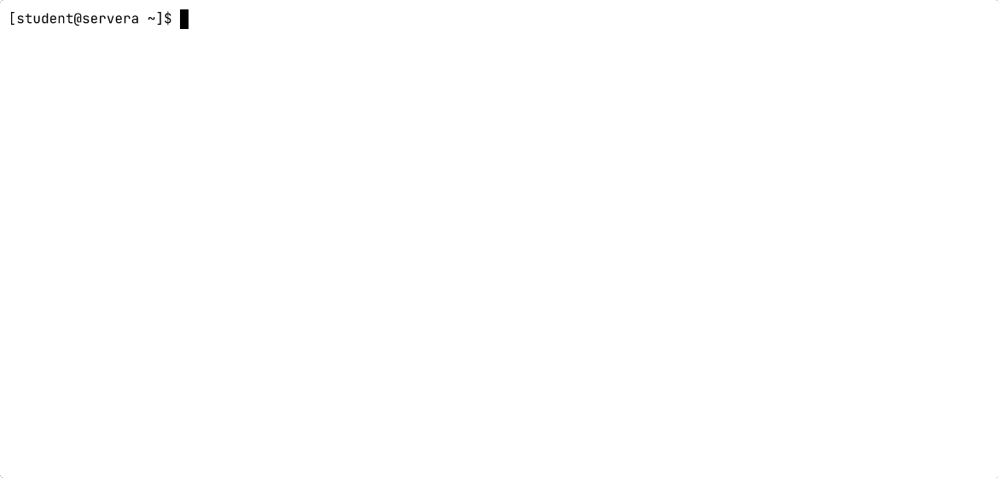

# Getting Data Into a Script

## Variables, input, and arguments

---
layout: two-cols-header
vertical: center
---

# Variables

A name holding a value you can use later

::left::

## What is printed?

```bash
switch_ip='172.25.250.1'
echo "$switch_ip"
```

<v-click>

```bash [Output]
172.25.250.1
```

</v-click>

::right::

<v-click>

## And here?

```bash
switch_ip='172.25.250.1'
switch_ip='172.25.250.2'
echo "$switch_ip"
```

<v-click>

```bash [Output]
172.25.250.2
```

An assignment replaces the old value, so the last one wins

</v-click>

</v-click>

---
layout: two-cols-header
leftWidth: 55
---

# The `read` Command

`read` pauses the script and waits for a line from **stdin**, then stores it in a variable

::left::

```bash [greeter.sh]
#!/bin/bash
echo "Enter your last name:"
read -r last_name
echo "Hello $1 $last_name from $0"
```

- `-r` treats backslashes literally, so use it every time
- The script stops until a full line arrives
- **stdin** is normally the keyboard

::right::



---
layout: two-cols-header
---

# Standard Output and Standard Input

::left::

## `>` redirects **stdout**

Standard output normally goes to the terminal

`>` changes the destination to a file

```bash
echo "Student Extraordinaire" > file_name.txt
```

*Instead of printing to the screen, print to a file*

::right::

<v-click>

## `<` redirects **stdin**

Standard input normally comes from the keyboard

`<` changes the source to a file

```bash
./greeter.sh < file_name.txt
```

*Instead of me typing it, read it from here*

</v-click>

---

# Feeding `read` from a File


The script cannot tell the difference. It just reads a line from **stdin**

---
layout: two-cols-header
leftWidth: 38
---

# Arguments

Values handed to the script on the command line

::left::

| Variable | Holds               |
| -------- | ------------------- |
| `$0`     | The script name     |
| `$1`     | The first argument  |
| `$2`     | The second argument |
| `$3`     | The third argument  |
| `$#`     | How many arguments  |
| `$@`     | All of them         |

::right::

```bash [argument_lister.sh]
#!/bin/bash
echo "Starting $0"
echo "You passed in $# arguments"
echo "The first argument is $1"
echo "The second argument is $2"
echo "All: $@"
```

---

# Arguments in Action

Bash substitutes each value before the script runs

<TerminalWindow title="student@servera:~/scripts">

````md magic-move
```bash-session
student@servera:~/scripts$ ./argument_lister.sh /etc /var/log /tmp
```
```bash-session
student@servera:~/scripts$ ./argument_lister.sh /etc /var/log /tmp
Starting ./argument_lister.sh
You passed in 3 arguments
```
```bash-session
student@servera:~/scripts$ ./argument_lister.sh /etc /var/log /tmp
Starting ./argument_lister.sh
You passed in 3 arguments
The first argument is /etc
The second argument is /var/log
All: /etc /var/log /tmp
student@servera:~/scripts$
```
````

</TerminalWindow>

---
vertical: center
---

# Command Substitution

`basename` strips a path down to the file name

<TerminalWindow title="student@servera:~">

```bash-session
student@servera:~$ basename /etc/httpd/conf/httpd.conf
httpd.conf
student@servera:~$
```

</TerminalWindow>

Wrap a command in `$( )` and Bash runs it first, then substitutes its output

<v-click>

<TerminalWindow title="student@servera:~">

```bash-session
student@servera:~$ file_name=$(basename /etc/httpd/conf/httpd.conf)
student@servera:~$ echo "$file_name"
httpd.conf
student@servera:~$
```

</TerminalWindow>

</v-click>

---
layout: exercise
---

# Passing Data to a Script

::goal::

Build a second script and feed it data as an argument, as typed input, and from a file

::environment::

**Host:** `servera`

::workflow::

1. Create a new script from scratch and make it executable
2. Take the technician name as an argument
3. Read the starship name from **stdin**
4. Supply that input from a file instead of the keyboard
5. Add a value produced by another command
