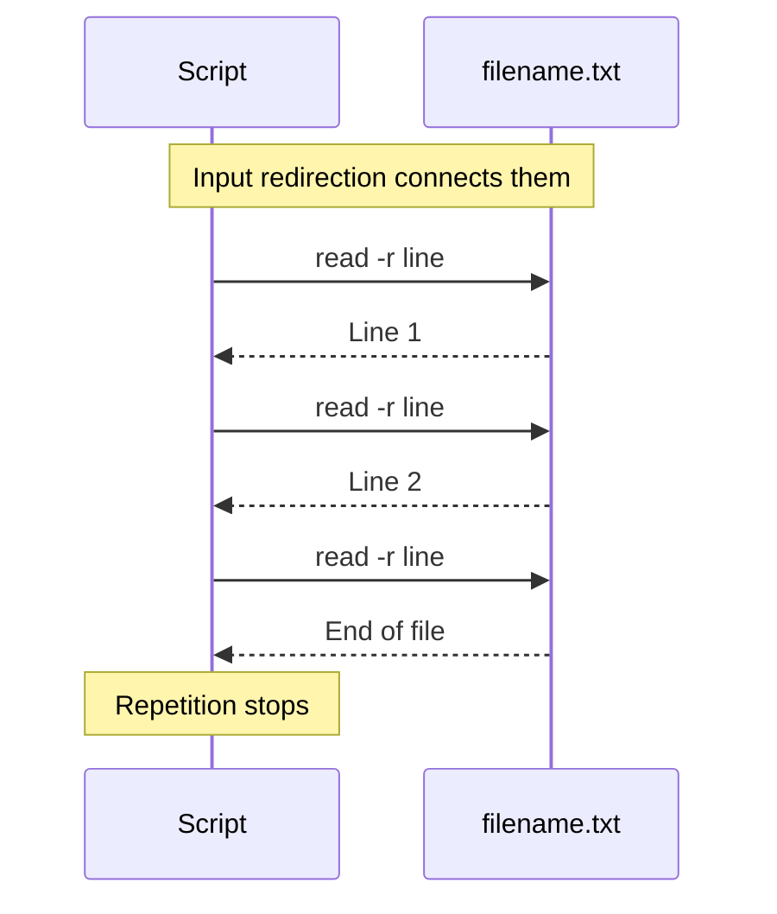
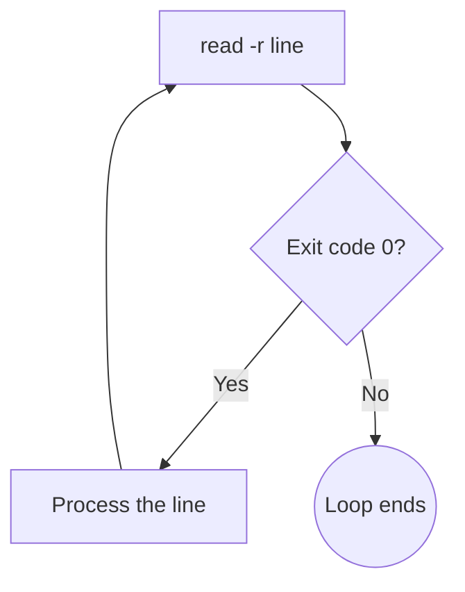

# While Loops

## Repeating until something changes

---
layout: two-cols-header
vertical: center
---

# `while` Repeats As Long As the Condition Succeeds

::left::

## Syntax

```bash {1,3}{lines:true}
while CONDITION; do
    COMMAND
done
```

A `for` loop knows its list up front, but a `while` loop does not

::right::

## Waiting for a host to come back

```bash
while ! ping -c1 -W1 172.25.250.10; do
    echo "Waiting for host..."
    sleep 1
done
echo "Host is up!"
```

<v-click>

```bash [Output]
Waiting for host...
Host is up!
```

</v-click>

---
layout: two-cols-header
leftWidth: 55
---

# Loops That Never End

A condition that is always true produces a loop that runs forever

::left::

```bash
while true; do
    echo "Scanning for new files"
    sleep 10
done
```

Stop it with <kbd>Ctrl</kbd>+<kbd>C</kbd>, or `kill` it from another shell

<Callout type="warning">

An accidental one fills a disk or pegs a CPU.

</Callout>

::right::


---
layout: two-cols-header
leftWidth: 65
listSpacing: padded
---

# Reading a File Line by Line

The most common `while` loop an administrator writes

::left::

```bash
while read -r line; do
    echo "Processing: $line"
done < filename.txt
```

- `< filename.txt` feeds the file into the loop's **stdin**
- `read -r line` takes one line and stores it in `$line`
- The body runs once per line

::right::



---
layout: two-cols-header
leftWidth: 70
---

# Why Does That Loop Ever Stop?

::left::

`read` is a command, so it reports an exit code like any other

- <SuccessText>Success, `0`</SuccessText>: it read a line
- <DangerText>Failure, `1`</DangerText>: it reached the end of the file

`while` keeps going as long as `read` returns `0`

The loop ends when the file has no more lines to process

::right::



---
layout: exercise
---

# Creating Users from a File

::goal::

Create a user account for every name listed in an input file

::environment::

**Host:** `servera`

::workflow::

1. Write the list of accounts to create into an input file
2. Create an executable script that reads the file line by line
3. Create each listed account and report whether it worked
4. Refuse to run unless the script was started with root privileges
5. Skip blank lines, then rerun the script to confirm it is safe to repeat
6. Remove the accounts the script created

---

# Remember This?

<v-switch at="0">

<template #0>

This morning it was the part of `~/.bashrc` you could not read yet

<TerminalWindow title="student@servera:~" :rows="9">

```bash-session
#^ The block at the bottom of ~/.bashrc
if [ -d ~/.bashrc.d ]; then
    for rc in ~/.bashrc.d/*; do
        if [ -f "$rc" ]; then
            . "$rc"
        fi
    done
fi
unset rc
```

</TerminalWindow>

</template>

<template #1>

Only run this if the directory exists

<TerminalWindow title="student@servera:~" :rows="9">

```bash-session {2,8}
#^ The block at the bottom of ~/.bashrc
if [ -d ~/.bashrc.d ]; then
    for rc in ~/.bashrc.d/*; do
        if [ -f "$rc" ]; then
            . "$rc"
        fi
    done
fi
unset rc
```

</TerminalWindow>

</template>

<template #2>

Loop over every name the glob matches

<TerminalWindow title="student@servera:~" :rows="9">

```bash-session {3,7}
#^ The block at the bottom of ~/.bashrc
if [ -d ~/.bashrc.d ]; then
    for rc in ~/.bashrc.d/*; do
        if [ -f "$rc" ]; then
            . "$rc"
        fi
    done
fi
unset rc
```

</TerminalWindow>

</template>

<template #3>

Skip anything that is not a regular file, then source what is left

<TerminalWindow title="student@servera:~" :rows="9">

```bash-session {4,5,6,9}
#^ The block at the bottom of ~/.bashrc
if [ -d ~/.bashrc.d ]; then
    for rc in ~/.bashrc.d/*; do
        if [ -f "$rc" ]; then
            . "$rc"
        fi
    done
fi
unset rc
```

</TerminalWindow>

</template>

</v-switch>

<Callout>

`[ ]` is the older syntax for `[[ ]]`. RHA Material uses `[[ ]]`

</Callout>
