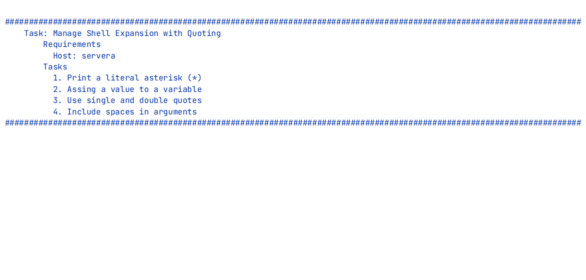

# Quoting

## Protecting characters from Bash expansion

---
---

# Protect a Character: Backslash

## Backslash `\`

Protects exactly <AccentText>one</AccentText> following character.

<TerminalWindow title="student@servera:~">

```bash-session
student@servera:~$ echo \*
*
student@servera:~$
```

</TerminalWindow>

The backslash protects the asterisk without quoting the whole argument.


---
---

# Protect a Character: Single Quotes

## Single quotes `'...'`

Everything inside is <SuccessText>literal</SuccessText>. Bash expands nothing.

<TerminalWindow title="student@servera:~">

```bash-session
student@servera:~$ echo *
filea.txt fileb.md filec.sh
student@servera:~$ echo '*'
*
student@servera:~$
```

</TerminalWindow>

The single quotes make Bash hand the asterisk to `echo` unchanged.

---
---

# Protect a Character: Double Quotes

## Double quotes `"..."`

The asterisk stays <SuccessText>literal</SuccessText>

Bash can still expand variables (`$HOSTNAME`) and command substitutions (`$(...)`).

<TerminalWindow title="student@servera:~">

```bash-session
student@servera:~$ echo "*"
*
student@servera:~$
```

</TerminalWindow>

Use double quotes when some expansion should remain available.

---
---

# Variables: A Preview of Next Week

Assign with `name=value`

<TerminalWindow title="student@servera:~">

````md magic-move
```bash-session
student@servera:~$ host=servera
student@servera:~$
```
````

</TerminalWindow>

<Callout type=warning>

No spaces around the equal sign!

</Callout>

---
---

# Variables: A Preview of Next Week

Read the value back by prefixing the name with `$`.

<TerminalWindow title="student@servera:~">

````md magic-move
```bash-session
student@servera:~$ host=servera
student@servera:~$
```
```bash-session
student@servera:~$ host=servera
student@servera:~$ echo $host
```
```bash-session
student@servera:~$ host=servera
student@servera:~$ echo $host
servera
student@servera:~$
```
```bash-session
student@servera:~$ host=servera
student@servera:~$ echo $host
servera
student@servera:~$ host=serverb
```
```bash-session
student@servera:~$ host=servera
student@servera:~$ echo $host
servera
student@servera:~$ host=serverb
student@servera:~$
```
```bash-session
student@servera:~$ host=servera
student@servera:~$ echo $host
servera
student@servera:~$ host=serverb
student@servera:~$ echo "$host"
```
```bash-session
student@servera:~$ host=servera
student@servera:~$ echo $host
servera
student@servera:~$ host=serverb
student@servera:~$ echo "$host"
serverb
student@servera:~$
```
````

</TerminalWindow>


We will build on this during the shell scripting class.

---
---

# Same Command, Three Quoting Styles

<TerminalWindow title="student@servera:~">

````md magic-move
```bash-session
student@servera:~$ host=servera
student@servera:~$ echo 'Checking $host'
```
```bash-session
student@servera:~$ host=servera
student@servera:~$ echo 'Checking $host'
Checking $host
student@servera:~$
```
```bash-session
student@servera:~$ host=servera
student@servera:~$ echo 'Checking $host'
Checking $host
student@servera:~$ echo "Checking $host"
```
```bash-session
student@servera:~$ host=servera
student@servera:~$ echo 'Checking $host'
Checking $host
student@servera:~$ echo "Checking $host"
Checking servera
student@servera:~$
```
```bash-session
student@servera:~$ host=servera
student@servera:~$ echo 'Checking $host'
Checking $host
student@servera:~$ echo "Checking $host"
Checking servera
student@servera:~$ echo "Checking ${host}.lab.example.com"
```
```bash-session
student@servera:~$ host=servera
student@servera:~$ echo 'Checking $host'
Checking $host
student@servera:~$ echo "Checking $host"
Checking servera
student@servera:~$ echo "Checking ${host}.lab.example.com"
Checking servera.lab.example.com
student@servera:~$
```
````

</TerminalWindow>

Single quotes print the name.

Double quotes print the value.

Braces mark where the name ends.

---
vertical: center
---

# Escaping Inside Double Quotes

A backslash still works inside double quotes

<TerminalWindow title="student@servera:~">

```bash-session
student@servera:~$ echo "The variable is named \$host"
The variable is named $host
student@servera:~$
```

</TerminalWindow>

---
---

# Spaces Separate Arguments

`mkdir My Files` creates <DangerText>two</DangerText> directories: `My` and `Files`

<TerminalWindow title="student@servera:~">

````md magic-move
```bash-session
student@servera:~$ mkdir My Files
student@servera:~$
```
```bash-session
student@servera:~$ mkdir My Files
student@servera:~$ ls
```
```bash-session
student@servera:~$ mkdir My Files
student@servera:~$ ls
Files  My
student@servera:~$
```
````

</TerminalWindow>

---
---

# Spaces Separate Arguments

Quote the whole name

<TerminalWindow title="student@servera:~">

````md magic-move
```bash-session
student@servera:~$ mkdir "My Files"
student@servera:~$
```
```bash-session
student@servera:~$ mkdir "My Files"
student@servera:~$ ls
'My Files'
student@servera:~$
```
```bash-session
student@servera:~$ mkdir "My Files"
student@servera:~$ ls
'My Files'
student@servera:~$ mkdir 'More Files'
student@servera:~$
```
```bash-session
student@servera:~$ mkdir "My Files"
student@servera:~$ ls
'My Files'
student@servera:~$ mkdir 'More Files'
student@servera:~$ ls
```
```bash-session
student@servera:~$ mkdir "My Files"
student@servera:~$ ls
'My Files'
student@servera:~$ mkdir 'More Files'
student@servera:~$ ls
'More Files' 'My Files'
```
````

</TerminalWindow>

Using single or double quotes

---
---

# Spaces Separate Arguments

Escape the space

<TerminalWindow title="student@servera:~">

````md magic-move
```bash-session
student@servera:~$ mkdir My\ Files
student@servera:~$
```
```bash-session
student@servera:~$ mkdir My\ Files
student@servera:~$ ls
```
```bash-session
student@servera:~$ mkdir My\ Files
student@servera:~$ ls
'My Files'
student@servera:~$
```
````

</TerminalWindow>

---
---

# Exercise: Quoting

## Requirements

Host: `servera`

## Steps

1. Print a literal asterisk (*)
2. Assign a value to a variable
3. Use single and double quotes
4. Include spaces in arguments

---
horizontal: center
---

# Exercise: Quoting



<a href="https://asciinema.org/a/1263848" target="_blank" rel="noopener noreferrer" aria-label="Watch the Quoting recording in a new tab">Asciinema recording</a> · <a href="../resources/quoting-exercise.html" target="_blank" rel="noopener noreferrer" aria-label="Read the written Quoting exercise in a new tab">Written exercise</a>
