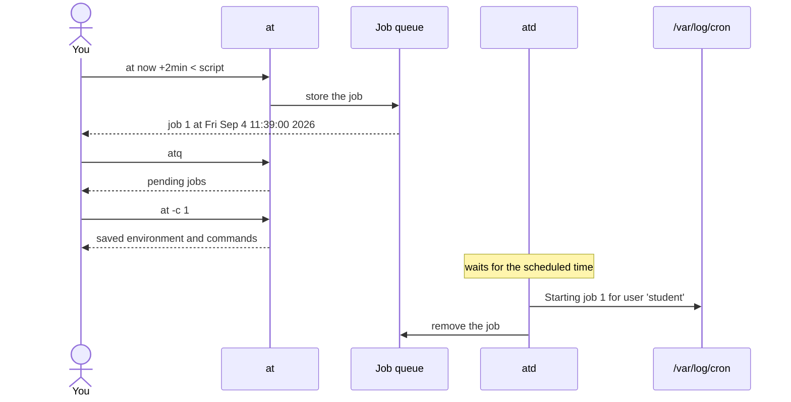

# Deferred Jobs with `at`

## Run a one-off command at some future time

---
vertical: center
---

# Do This, Later

Hand a command to `at` and walk away

- Good for <SuccessText>one-off</SuccessText> jobs that run once and are done
- Not for <DangerText>recurring</DangerText> jobs like every day at 8 p.m.

```bash
echo "reboot" | at now +2min
at 23:10 < database_backup.sh
```

<Callout>

Reset a firewall in ten minutes, in case the rule you are about to write locks you out.

</Callout>

---

# Install `at`

The package is not part of a minimal RHEL installation

<TerminalWindow title="student@servera:~" :rows="14">

```bash-session {*}{lines:false}
student@servera:~$ sudo dnf install at
...output omitted...
Installing:
 at          x86_64          3.2.5-12.el10            dvd-baseos           70 k

Transaction Summary
================================================================================
Install  1 Package
...output omitted...
Is this ok [y/N]: y
...output omitted...
Created symlink '/etc/systemd/system/multi-user.target.wants/atd.service' → '/usr/lib/systemd/system/atd.service'.
...output omitted...
Complete!
```

</TerminalWindow>

Installing the package <AccentText>enables</AccentText> `atd`, but does not start it

---

# Start `atd`

`at` only queues jobs, and `atd` is the daemon that runs them

<TerminalWindow title="student@servera:~" :rows="6">

````md magic-move
```bash-session
student@servera:~$ systemctl is-active atd
inactive
```
```bash-session
student@servera:~$ systemctl is-active atd
inactive
student@servera:~$ sudo systemctl start atd
student@servera:~$ systemctl is-active atd
active
```
````

</TerminalWindow>

<Callout type="warning">

A job scheduled while `atd` is stopped waits in the queue. It does not run on time.

</Callout>

---
layout: two-cols-header
vertical: center
---

# Two Ways to Hand Over a Command

`at` reads the commands to run from standard input

::left::

## Pipe a command

<TerminalWindow title="student@servera:~" :rows="4">

```bash-session
student@servera:~$ echo "reboot" | at now +2min
warning: commands will be executed using /bin/sh
job 1 at Fri Sep  4 11:39:00 2026
```

</TerminalWindow>

::right::

## Redirect a script

<TerminalWindow title="student@servera:~" :rows="4">

```bash-session
student@servera:~$ at now +1min < database_backup.sh
warning: commands will be executed using /bin/sh
job 2 at Fri Sep  4 11:46:00 2026
```

</TerminalWindow>

---
layout: center
---

# View the Queue

<TextExplainer
  :lines="[
    'student@servera:~$ atq',
    '1   Fri Sep  4 11:46:00 2026   a   student',
  ]"
  :steps="[
    { line: 2, text: '1', occurrence: 1, explanation: 'The job number' },
    { line: 2, text: 'Fri Sep  4 11:46:00 2026', explanation: 'When the job runs' },
    { line: 2, text: 'a', explanation: 'The queue it sits on, a through z' },
    { line: 2, text: 'student', explanation: 'The user it runs as' },
  ]"
/>

---

# Inspect a Job

`at -c` prints the job as `atd` will run it, including the environment `at` saved for you

<TerminalWindow title="student@servera:~" :rows="15">

```bash-session {*}{lines:false}
student@servera:~$ at -c 1
#!/bin/sh
# atrun uid=1000 gid=1000
# mail student 0
umask 22
SHELL=/bin/bash; export SHELL
PWD=/home/student; export PWD
...many more environment variables omitted...
cd /home/student || {
	 echo 'Execution directory inaccessible' >&2
	 exit 1
}
${SHELL:-/bin/sh} << 'marcinDELIMITER31c8c648'
date --iso-8601=seconds >> /tmp/backup.log
marcinDELIMITER31c8c648
```

</TerminalWindow>

---
vertical: center
---

# Remove a Job

`atrm` takes the job number from `atq`

<TerminalWindow title="student@servera:~" :rows="5">

````md magic-move
```bash-session
student@servera:~$ atq
1	Fri Sep  4 11:46:00 2026 a student
2	Fri Sep  4 12:36:00 2026 a student
```
```bash-session
student@servera:~$ atq
1	Fri Sep  4 11:46:00 2026 a student
2	Fri Sep  4 12:36:00 2026 a student
student@servera:~$ atrm 2
student@servera:~$ atq
1	Fri Sep  4 11:46:00 2026 a student
```
````

</TerminalWindow>

---

# Did It Run?

A job disappears from `atq` whether it succeeded or failed, so the log is the proof

<TerminalWindow title="student@servera:~" :rows="4">

```bash-session
student@servera:~$ sudo less /var/log/cron
Sep  4 11:37:00 servera atd[10208]: Starting job 1 (a0000101c6d839) for user 'student' (1000)
```

</TerminalWindow>

<Callout type="warning">

`atd` logs that it *started* the job. Check the job's own output to know what it did.

</Callout>

---
layout: center
---

# The Whole Trip



---
layout: exercise
---

# Finding Recently Modified Logs

::goal::

Schedule a search for recently changed log files and confirm that it ran

::environment::

**Host:** `servera`

::workflow::

1. Install `at` and start `atd`
2. Build a `find` command that lists logs modified in the last two minutes
3. Schedule that command to run two minutes from now
4. Inspect the pending job with `atq` and `at -c`
5. Confirm in `/var/log/cron` that `atd` started the job
6. Verify the file the job wrote
