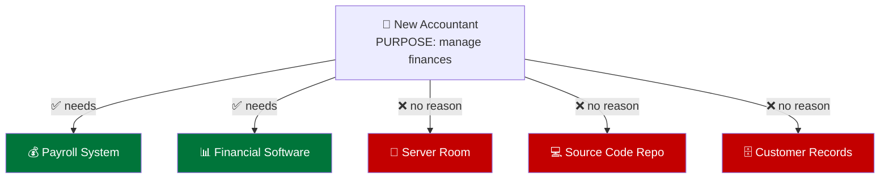
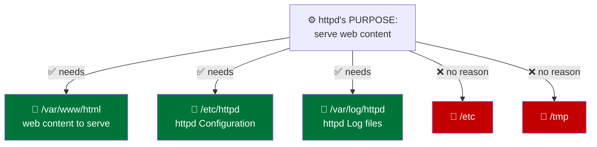
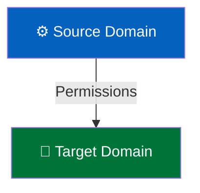
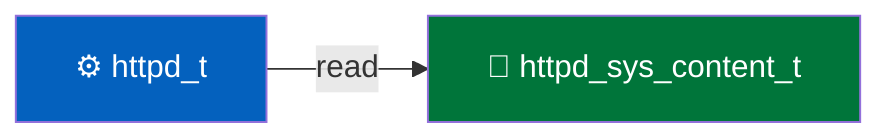
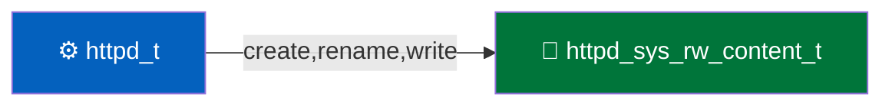

# Manage SELinux Security

## Security-Enhanced Linux

---

# Principle of Least Privilege

Applied to people

- New accountant is hired

<div v-click>

- Ask: What access do they need to do their job?
- Grant **only** that access, nothing more



</div>

<!--
Start with people before processes. Nobody argues that a new accountant needs the server room key.
-->

---

# Principle of Least Privilege

> **SELinux applies Principle of Least Privilege to processes**

- Apache web server is installed
- What access does the `httpd` process need to do its job?
- Grant **only** that access, nothing more



<!--
The three green boxes are the content, configuration, and log rows from last week's Apache component table.

Why it matters: if an attacker takes over httpd through a bad script, file permissions alone still let that process write to /tmp and /var/tmp like any other user. SELinux keeps the compromised process inside the few places its job needs. The RHCSA Cert Guide opens chapter 22 with a story along these lines.
-->

---
listSpacing: padded
---

# Principle of Least Privilege: DAC vs MAC

## Don't File Permissions Already Do This?

- Yes, but they can be set by the file owner
- Discretionary Access Control (DAC)
- Up to the discretion of the file owner

## Only System Administrators Can Change SELinux Policy

- Mandatory Access Control (MAC)
- Mandated by the system administrator

<!--
Both apply. An action has to pass the file permissions and the SELinux policy. SELinux never grants access that permissions deny.
-->

---

# Every Process Has a Label

- Viewed using `ps -AZ`

## View Process Label

<TerminalWindow title="student@servera:~">

```bash-session
student@servera:~$ ps -AZ | grep httpd
system_u:system_r:httpd_t:s0       2205 ?        00:00:00 httpd
system_u:system_r:httpd_t:s0       2206 ?        00:00:00 httpd
system_u:system_r:httpd_t:s0       2207 ?        00:00:00 httpd
system_u:system_r:httpd_t:s0       2209 ?        00:00:00 httpd
system_u:system_r:httpd_t:s0       2210 ?        00:00:00 httpd
```

</TerminalWindow>

<!--
Every httpd process runs as httpd_t. -A lists every process, and -Z adds the LABEL column. The same -Z works with ps aux as ps -auxZ, but its lines are too wide for a slide.
-->

---

# Every File Has a Label

- Viewed using `ls -lZ`

## View File Label

<TerminalWindow title="student@servera:~">

```bash-session
student@servera:~$ ls -lZ /var/www/html/
total 4
drwxr-xr-x. 2 root root unconfined_u:object_r:httpd_sys_content_t:s0  6 Sep 17 10:56 about
-rw-r--r--. 1 root root unconfined_u:object_r:httpd_sys_content_t:s0 28 Sep 17 10:56 index.html
```

</TerminalWindow>

---

# SELinux Context Labels

<TextExplainer
  :lines="['system_u:object_r:httpd_sys_content_t:s0']"
  :steps="[
    { line: 1, text: 'system_u:', explanation: 'SELinux User' },
    { line: 1, text: 'object_r:', explanation: 'Role' },
    { line: 1, text: 'httpd_sys_content_t:', explanation: 'Type - Most commonly used!' },
    { line: 1, text: 's0', explanation: 'Level' },
  ]"
/>

<!--
Targeted policy, the RHEL default, makes its decisions with the type. Types end in _t. User, role, and level matter only in advanced configurations.
-->

---
layout: two-cols-header
---

# SELinux Policy

List of Rules

::left::

## Rule

- Source Domain
  - Usually a process
- Target Domain
  - Usually a file or directory
- List of permissions
  - read, write, etc.

::right::



<!--
The policy is a list of allow rules. Anything no rule allows is denied.
-->

---

# View SELinux Rule

- Viewed using `sesearch -A`

## View SELinux Rule

<TerminalWindow title="student@servera:~">

```bash-session
student@servera:~$ sesearch -A
...output omitted...
allow httpd_t httpd_sys_content_t:dir { ioctl lock read };
allow httpd_t httpd_sys_rw_content_t:dir { add_name remove_name write }; [ httpd_builtin_scripting ]:True
...output omitted...
```

</TerminalWindow>

<div class="flex flex-col items-center gap-4">





</div>

<!--
sesearch comes from the setools-console package, which the lab does not install by default: sudo dnf install -y setools-console

Bare sesearch -A prints the entire policy, more than 56,000 rules on RHEL 10. These are two of them. The bracket on the second rule means it applies only while the httpd_builtin_scripting boolean is on, which it is by default.

To narrow the search: sesearch -A -s httpd_t -t httpd_sys_content_t -c dir
-->

---

```bash-session [Source Domain: httpd process]
student@servera:~$ ps -AZ | grep httpd
system_u:system_r:httpd_t:s0       2205 ?        00:00:00 httpd
...output omitted...
```

```bash-session [Target Domain: html directory]
student@servera:~$ ls -lZ /var/www
...output omitted...
drwxr-xr-x. 3 root root system_u:object_r:httpd_sys_content_t:s0     37 Sep 17 10:56 html
```

```text [SELinux Rule: sesearch -A output]
#     Source  Target              Access
allow httpd_t httpd_sys_content_t:dir { ioctl lock read };
```

<!--
The source domain's type, the target domain's type, and the rule that joins them.
-->

---


<!--
Treat the server as a building. Each room is a type, and each door is an allow rule.

The intruder broke in through a flaw in the web server, so they are standing in the httpd_t room. They can walk through the doors the policy gives httpd_t: the content it serves and the content it may write. They cannot reach tmp_t, etc_t, or anyone's home directory, because no rule puts a door there.

File permissions alone would have let a compromised httpd wander into /tmp. SELinux keeps the break-in in one wing.
-->

---
layout: exercise
---

# Set Up a Basic Web Server

::goal::

Install a basic web server

::environment::

**Host:** `workstation`

::workflow::

1. Install the `httpd` package
2. Create a web page
3. Enable and start the systemd service
4. Verify the results
