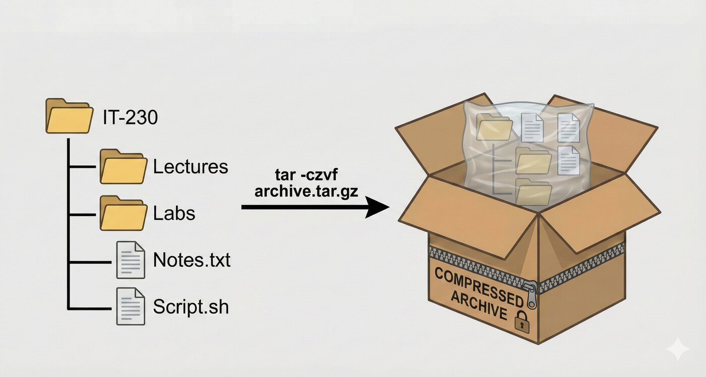

# Archives

## Many files in, one file out

---
layout: two-cols-header
leftWidth: 55
---

# Why Bundle Files at All?

::left::

## Simpler handling

One file is easier to back up, and manage

## Better compression

A single stream of data compresses better than each file individually

<Callout>

Bundling and compressing are two separate jobs.

`tar` does the first but calls a compressor for the second

</Callout>

::right::

## Preserved characteristics

An archive can keep the:

- directory structure
- ownership
- permissions
- timestamps
- etc.


<!--
An archive is also the one file you would move with the scp or rsync commands from week 2.
-->

---
layout: two-cols-header
leftWidth: 45
---

# `tar`: Tape ARchive

::left::

## What is an archive?

- One file that contains many files
- The Unix ancestor of the `.zip` file you know from Windows

## How?

- The `tar` command
- **T**ape **AR**chive

::right::



<!--
The command in the picture adds z for compression, which comes up in the next section.
-->

---
layout: two-cols-header
---


::left::

# Yes, They Really Used to Put <AccentText>Data</AccentText> on Cassette Tapes!

`tar` was written to send data to magnetic **tape**, one file after another in a single continuous stream

::right::


Photograph by [Robert Jacek Tomczak](https://commons.wikimedia.org/wiki/User:Rjt), [CC BY-SA 3.0](https://creativecommons.org/licenses/by-sa/3.0/), via [Wikimedia Commons](https://commons.wikimedia.org/w/index.php?curid=94360)

---
layout: center
---

# Creating an Archive

<TextExplainer
  :lines="['tar -cvf /tmp/log-backup.tar /var/log']"
  :steps="[
    { line: 1, text: 'tar', occurrence: 1, explanation: 'The Tape ARchive Command' },
    { line: 1, text: '-c', explanation: 'Create archive' },
    { line: 1, text: 'v', occurrence: 1, explanation: 'Verbose Output' },
    { line: 1, text: 'f /tmp/log-backup.tar', explanation: 'Filename flag and the target file' },
    { line: 1, text: '/var/log', explanation: 'Source Directory' },
  ]"
/>

<!--
Reading everything under /var/log needs root, so the next slides run as root.
-->

---
vertical: start
---

# Creating an Archive

<TerminalWindow title="root@servera:~" :rows="10">

````md magic-move
```bash-session
root@servera:~# tar -cvf /tmp/log-backup.tar /var/log
```
```bash-session
root@servera:~# tar -cvf /tmp/log-backup.tar /var/log
tar: Removing leading `/' from member names
/var/log/
/var/log/private/
/var/log/wtmp
/var/log/lastlog
...output omitted...
```
```bash-session
root@servera:~# tar -cvf /tmp/log-backup.tar /var/log
tar: Removing leading `/' from member names
/var/log/
/var/log/private/
/var/log/wtmp
/var/log/lastlog
...output omitted...
root@servera:~# ls -lh /tmp/log-backup.tar
```
```bash-session
root@servera:~# tar -cvf /tmp/log-backup.tar /var/log
tar: Removing leading `/' from member names
/var/log/
/var/log/private/
/var/log/wtmp
/var/log/lastlog
...output omitted...
root@servera:~# ls -lh /tmp/log-backup.tar
-rw-r--r--. 1 root root 7.1M Sep 17 11:01 /tmp/log-backup.tar
root@servera:~#
```
````

</TerminalWindow>

<Callout type="warning">

`tar` strips the leading `/` so the archive cannot overwrite `/var/log` when someone extracts it somewhere else

</Callout>

---
vertical: center
---

# Listing What Is Inside

Read the contents without unpacking anything

<TextExplainer
  :lines="['tar -tf /tmp/log-backup.tar']"
  :steps="[
    { line: 1, text: '-t', explanation: 'lisT: show the member names' },
    { line: 1, text: 'f /tmp/log-backup.tar', explanation: 'File: the archive to inspect' },
  ]"
/>

<TerminalWindow title="root@servera:~">

```bash-session
root@servera:~# tar -tf /tmp/log-backup.tar | head -n4
var/log/
var/log/private/
var/log/wtmp
var/log/lastlog
root@servera:~#
```

</TerminalWindow>

---
vertical: start
---

# Extracting an Archive

`tar` unpacks into the <DangerText>current working directory</DangerText>, so change into an empty one first

<TerminalWindow title="root@servera:~" :rows="6">

````md magic-move
```bash-session
root@servera:~# mkdir -p /tmp/log-extract
root@servera:~# cd /tmp/log-extract
```
```bash-session
root@servera:~# mkdir -p /tmp/log-extract
root@servera:~# cd /tmp/log-extract
root@servera:/tmp/log-extract# tar -xf /tmp/log-backup.tar
```
```bash-session
root@servera:~# mkdir -p /tmp/log-extract
root@servera:~# cd /tmp/log-extract
root@servera:/tmp/log-extract# tar -xf /tmp/log-backup.tar
root@servera:/tmp/log-extract# ls
var
root@servera:/tmp/log-extract#
```
````

</TerminalWindow>

`-x` is e**x**tract

`-f` names the archive

---
vertical: center
---

# Extracting One File

Same extract command

Just add the file you want to extract at the end

Name the file exactly as `-t` printed it

<TerminalWindow title="root@servera:~">

```bash-session
root@servera:~# mkdir -p /tmp/log-one
root@servera:~# cd /tmp/log-one
root@servera:/tmp/log-one# tar -xf /tmp/log-backup.tar var/log/secure
root@servera:/tmp/log-one# ls var/log
secure
root@servera:/tmp/log-one#
```

</TerminalWindow>

<Callout>

Use `var/log/secure`, not `/var/log/secure`, because the archive stores the path without its leading slash

</Callout>

<!--
With the leading slash, tar answers "tar: /var/log/secure: Not found in archive" and exits with status 2.
-->

---
vertical: start
---

# The Three Operations

| Option | Name    | What it does                          |
| :----: | ------- | ------------------------------------- |
|  `-c`  | create  | build a new archive from files        |
|  `-t`  | lis**t**| show what is inside an archive        |
|  `-x`  | e**x**tract | unpack an archive into the current directory |

`-f` always names the archive file,

`-v` always makes the operation verbose

<Callout type="danger">

`-c` overwrites its target without asking, exactly like the `>` operator

</Callout>

---

# Archives and File Attributes

An archive leaves out extended attributes unless you ask for them

| Option      | Keeps                                                  |
|-------------|--------------------------------------------------------|
| `--selinux` | SELinux contexts                                       |
| `--acls`    | POSIX access control lists                             |
| `--xattrs`  | Other extended attributes                              |
| `-p`        | Original permissions on extract, already on for `root` |

Without `--selinux`, extracted files are labeled like any new file

<!--
Addition from RHA chapter 7 section 1. On servera, /var/log/secure is var_log_t. Extracted into /tmp/log-extract without --selinux, the copy is user_tmp_t. Archived and extracted with --selinux, it stays var_log_t.
-->

---
layout: exercise
---

# Creating and Extracting Archives

::goal::

Back up `/etc` and restore it somewhere safe

::environment::

**Host:** `servera`

::workflow::

1. Bundle all of `/etc` as `root` into one uncompressed archive under `/tmp`
2. Check the size of the archive you produced
3. Read the archive's contents without unpacking it
4. Unpack the archive into an empty directory of its own
5. Confirm the extracted tree looks like the original
6. Extract a single file into a fresh directory

---
layout: exercise
variant: recording
---

<script setup>
import castUrl from "./exercises/archives-exercise.cast?url";
</script>

# Creating and Extracting Archives

::recording::

<AsciinemaPlayer
    :src="castUrl"
    label="Screen recording of the instructor opening a root shell on servera, bundling /etc into an uncompressed archive with tar -cvf, checking its size with ls -lh, listing its members with tar -tf, extracting the archive into an empty directory and comparing etc/hosts with the original using diff, then extracting the single file etc/hosts into a fresh directory."
/>

::resources::

<a href="../resources/archives-exercise.html" target="_blank" rel="noopener noreferrer" aria-label="Read the written Creating and Extracting Archives exercise in a new tab">Written exercise</a>
