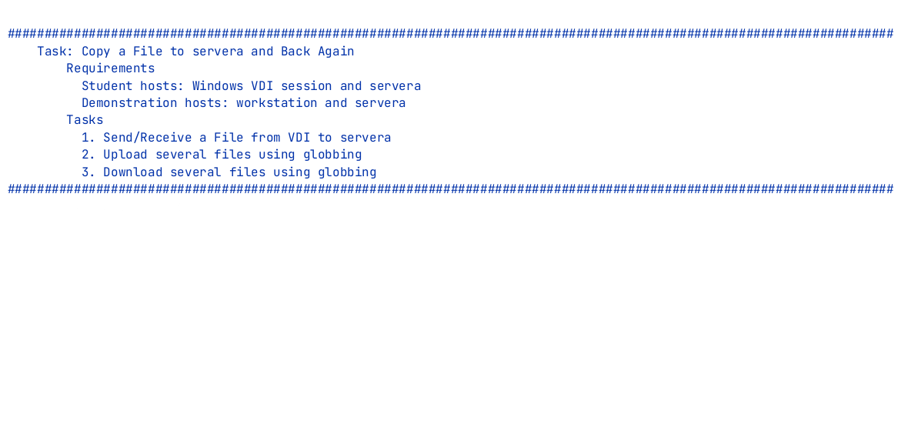

# `scp`

## Secure copy

---
vertical: center
---

# `cp` over `ssh`

`scp` is used to upload and download files from a remote machine

- `scp` is part of the **OpenSSH** suite and rides on top of `ssh`
- Installed by default on RHEL, macOS, and Windows and later
- Available anywhere SSH is available — nothing extra to configure
- Authenticates exactly the way `ssh` does

<Callout>

If you can `ssh` to a host, you can `scp` to it.

</Callout>

---
layout: two-cols-header
leftWidth: 45
vertical: center
---

# `cp` and `scp`

::left::

## Local copy

Copy `file.txt` into `/tmp`

<TerminalWindow title="student@workstation:~">

```bash-session
student@workstation:~$ cp file.txt /tmp
student@workstation:~$
```

</TerminalWindow>

::right::

<v-click>

## Remote copy

Copy `file.txt` into `/tmp` on `servera`

<TerminalWindow title="student@workstation:~">

```bash-session
student@workstation:~$ scp file.txt student@servera:/tmp
file.txt          100%  227     0.2KB/s   00:00
student@workstation:~$
```

</TerminalWindow>

</v-click>

---
layout: center
---

# Uploading a File

<CommandExplainer
  command="scp file.txt student@servera:/tmp"
  :steps="[
    { active: 'scp', explanation: 'Securely Copy Files' },
    { active: 'file.txt', explanation: 'The source — an ordinary local path' },
    { active: 'student@servera', explanation: 'The remote user and host (same syntax as ssh)' },
    { active: ':', explanation: 'The colon separates hostname and path' },
    { active: '/tmp', explanation: 'The destination directory on that host' },
  ]"
/>

---
layout: center
---

# Download a File

<CommandExplainer
  command="scp student@servera:/tmp/notes.txt ~"
  :steps="[
    { active: 'scp', explanation: 'Securely Copy Files' },
    { active: 'student@servera', explanation: 'The user and host on the remote machine' },
    { active: ':', explanation: 'The colon separates hostname and path' },
    { active: '/tmp/notes.txt', explanation: 'The source path on the remote host' },
    { active: '~', explanation: 'The destination local path (your home directory)' }
  ]"
/>


---
---

# Upload or Download

## <AccentText>Upload</AccentText> a File

Local path in first argument, remote host in second argument

<TerminalWindow title="student@workstation:~">

````md magic-move
```bash-session
student@workstation:~$ scp file.txt student@servera:/tmp
file.txt          100%  227     0.2KB/s   00:00
student@workstation:~$
```
````

</TerminalWindow>

<br />

## <AccentText>Download</AccentText> a File

Remote host in first argument, local path in second argument

<TerminalWindow title="student@workstation:~">

````md magic-move
```bash-session
student@workstation:~$ scp student@servera:/tmp/notes.txt ~
notes.txt         100%   84     0.1KB/s   00:00
student@workstation:~$
```
````

</TerminalWindow>

---
vertical: center
---

# Copying a Whole Directory

`-r` recursively copies entire directories, exactly as it does for `cp`

<TerminalWindow title="student@workstation:~">

```bash-session
student@workstation:~$ scp -r Documents student@servera:/tmp
student@workstation:~$
```

</TerminalWindow>

<Callout type="warning">

`scp` copies. It does not compare, skip, or resume — every byte crosses the network every time.

</Callout>

---
layout: exercise
---

# Copying Files with `scp`

::goal::

Transfer individual files and wildcard-selected groups among three systems

::environment::

**Hosts:** your Windows VDI, `workstation`, and `servera`

::workflow::

1. Transfer a file between the Windows VDI and `servera`
2. Upload several files using globbing
3. Download several files using globbing

---
layout: exercise
variant: recording
---

# Copying Files with `scp`

::recording::



::resources::

<a href="https://asciinema.org/a/1263865" target="_blank" rel="noopener noreferrer" aria-label="Watch the scp recording in a new tab">Asciinema recording</a><a href="../resources/scp-exercise.html" target="_blank" rel="noopener noreferrer" aria-label="Read the written scp exercise in a new tab">Written exercise</a>
