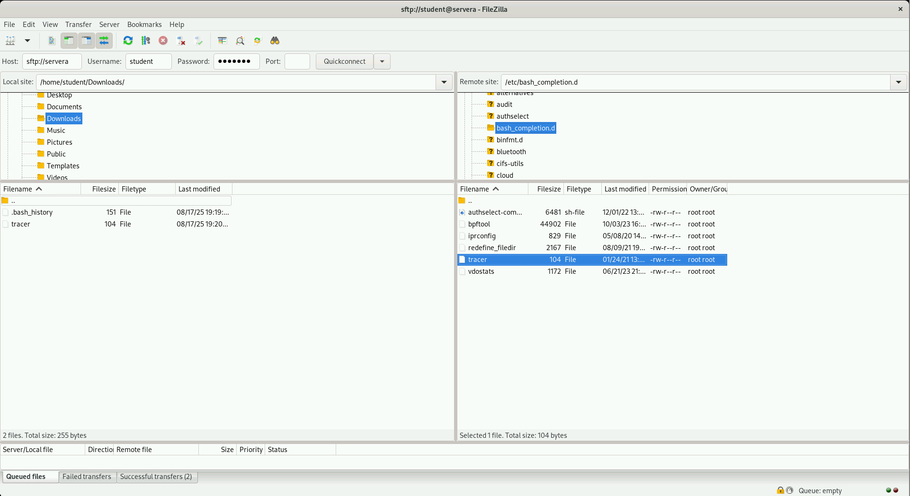

# `sftp`

## Secure File Transfer Protocol

---
vertical: center
---

# An Interactive Session Instead of One Command


`sftp` drops you into its own prompt so you can look around before deciding what to move

- `sftp` is also part of the **OpenSSH** suite and also rides on `ssh`
- Browse the remote directory tree
- Change directories on <AccentText>both</AccentText> ends
- Upload and download repeatedly in one connection

---
vertical: center
---

# Filezilla

Local on the Left - Remote on the Right




---
vertical: center
---

# Connecting

<TerminalWindow title="student@workstation:~">

````md magic-move
```bash-session
student@workstation:~$ sftp student@servera
```
```bash-session
student@workstation:~$ sftp student@servera
Connected to servera.
sftp>
```
````

</TerminalWindow>

The `sftp>` prompt replaces your shell prompt

Bash is not running here, only the commands `sftp` implements

---
vertical: center
---

# `help` Lists Everything Available

<TerminalWindow title="student@workstation:~">

```bash-session {*}{lines:false}
sftp> help
Available commands:
cd path                                 Change remote directory to 'path'
exit                                    Quit sftp
get [-afpR] remote [local]              Download file
lcd path                                Change local directory to 'path'
lls [ls-options [path]]                 Display local directory listing
lmkdir path                             Create local directory
lpwd                                    Print local working directory
ls [-1afhlnrSt] [path]                  Display remote directory listing
mkdir path                              Create remote directory
put [-afpR] local [remote]              Upload file
pwd                                     Display remote working directory
rename oldpath newpath                  Rename remote file
rm path                                 Delete remote file
!command                                Execute 'command' in local shell
sftp>
```

</TerminalWindow>

---
layout: two-cols-header
vertical: start
---

# Two Machines, One Prompt

Look carefully at that list: several commands appear twice

::left::

## Remote by default

Plain commands act on <AccentText>remote</AccentText>

| Command | Acts on the remote |
| ------- | ------------------ |
| `cd`    | change directory   |
| `pwd`   | print directory    |
| `ls`    | list directory     |
| `mkdir` | create directory   |

::right::

## Local with a leading `l`

Prefix with `l` to act on <AccentText>local</AccentText>

| Command  | Acts on the local |
| -------- | ----------------- |
| `lcd`    | change directory  |
| `lpwd`   | print directory   |
| `lls`    | list directory    |
| `lmkdir` | create directory  |

---
layout: center
---

# `get` is Named From Your Side

<CommandExplainer
  command="sftp> get /etc/passwd"
  :steps="[
    { active: 'sftp>', explanation: 'Secure File Transfer Protocol prompt' },
    { active: 'get', explanation: 'Download the file from the remote host to the local host' },
    { active: '/etc/passwd', explanation: 'Read from the remote working directory, written into the local working directory' },
  ]"
/>

---
layout: center
---

# `put` is Named From Your Side

<CommandExplainer
  command="sftp> put /etc/passwd"
  :steps="[
    { active: 'sftp>', explanation: 'Secure File Transfer Protocol prompt' },
    { active: 'put', explanation: 'Upload the file from the local host to the remote host' },
    { active: '/etc/passwd', explanation: 'Read from the local working directory, written into the remote working directory' },
  ]"
/>


---
---

# Downloading

Set the directory on each side, then `get`

<TerminalWindow title="student@workstation:~">

```bash-session
student@workstation:~$ sftp student@servera
sftp> lcd /home/student/Downloads
sftp> cd /etc
sftp> get passwd
Fetching /etc/passwd to passwd
passwd                                     100% 2374     2.3MB/s   00:00
sftp>
```

</TerminalWindow>

`lcd` chose where it landed (Destination)

`cd` chose where it came from (Source)

---
vertical: start
---

# Uploading

The same two commands, in the other direction

<TerminalWindow title="student@workstation:~">

```bash-session
sftp> mkdir hostbackup
sftp> cd hostbackup
sftp> put /etc/hosts
Uploading /etc/hosts to /home/student/hostbackup/hosts
/etc/hosts                                 100%  227     0.2KB/s   00:00
sftp>
```

</TerminalWindow>

<Callout>

`mkdir` created the directory on `servera`, because it has no leading `l`

</Callout>

---
vertical: center
---

# Leaving

`bye`, `exit`, and `quit` all close the session and return you to your shell

<TerminalWindow title="student@workstation:~">

```bash-session
sftp> bye
student@workstation:~$
```

</TerminalWindow>

---
listSpacing: padded
---

# `sftp` Without an Interactive Session

`sftp` can be used non-interactively similar to `scp`

<TerminalWindow title="student@workstation:~/Downloads">

```bash-session
student@workstation:~/Downloads$ sftp student@servera:/etc/group
Connected to servera.
Fetching /etc/group to group
group                                      100% 1118     1.1MB/s   00:00
student@workstation:~/Downloads$
```

</TerminalWindow>

- Same `user@host:path` shape as `scp`
- No `sftp>` prompt when the remote path names a file
- File lands in the current local directory

---

# Exercise: Downloading Files with `sftp`

## Requirements

Local host: `workstation`, in `/home/student/Downloads`

Remote host: `servera`, in `/etc`

## Steps

1. Open a transfer session and inspect both sides
2. Navigate the local side to `Downloads` and the remote side to `/etc`
3. Download and verify the `group` file
4. Leave the session, read the file and clean up
