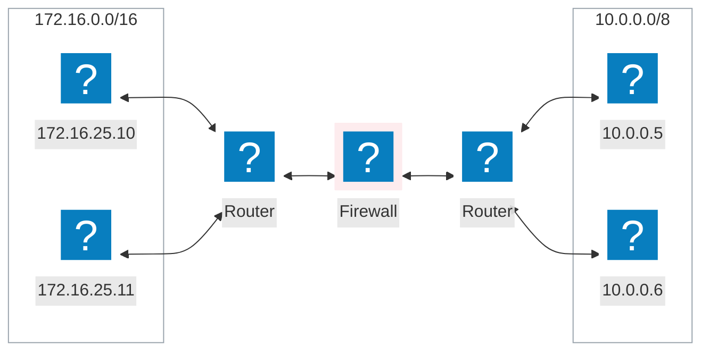
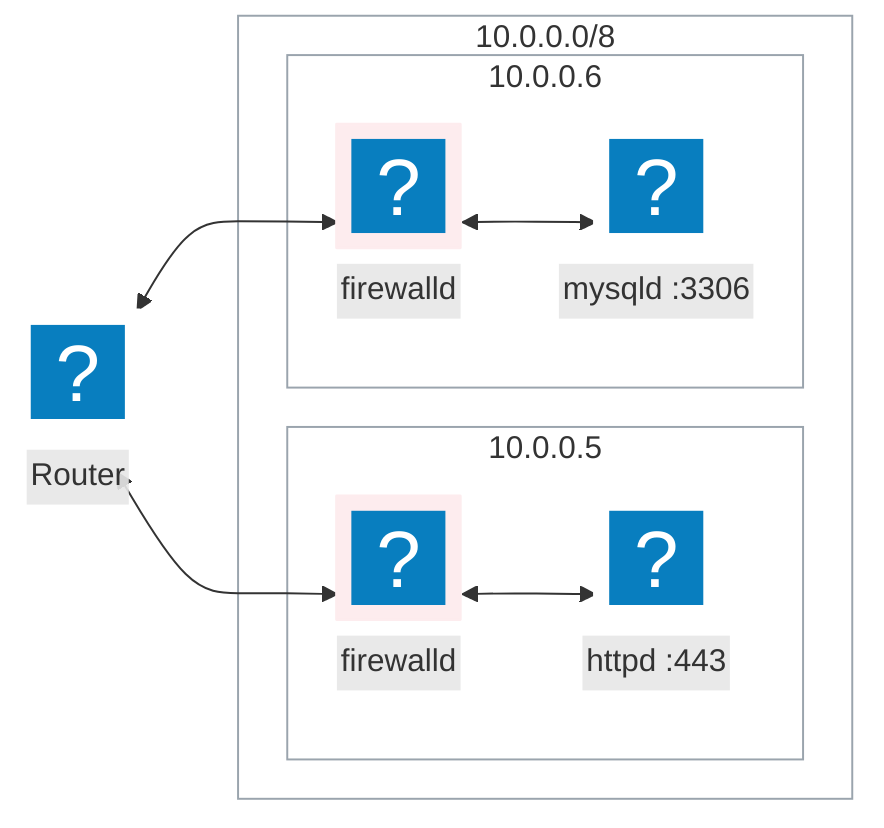
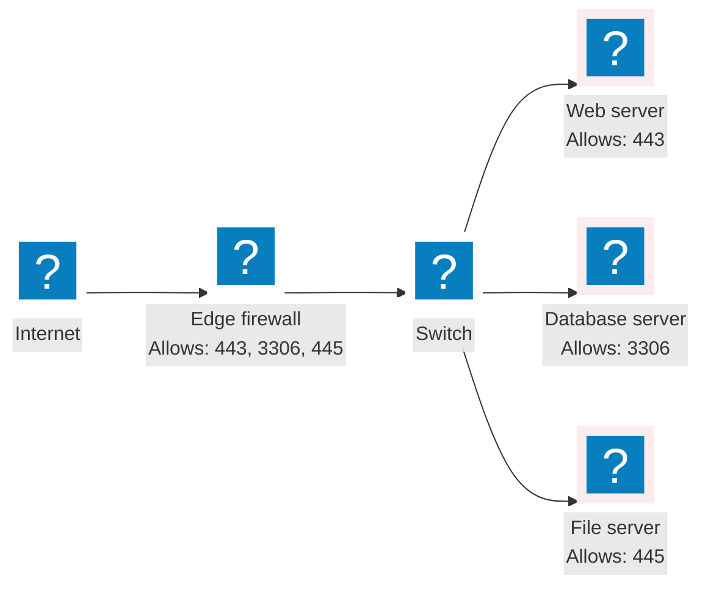
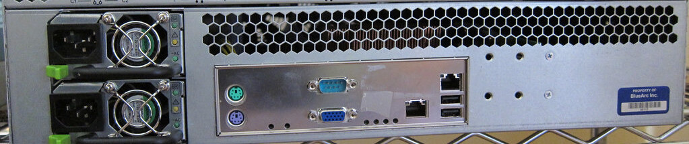
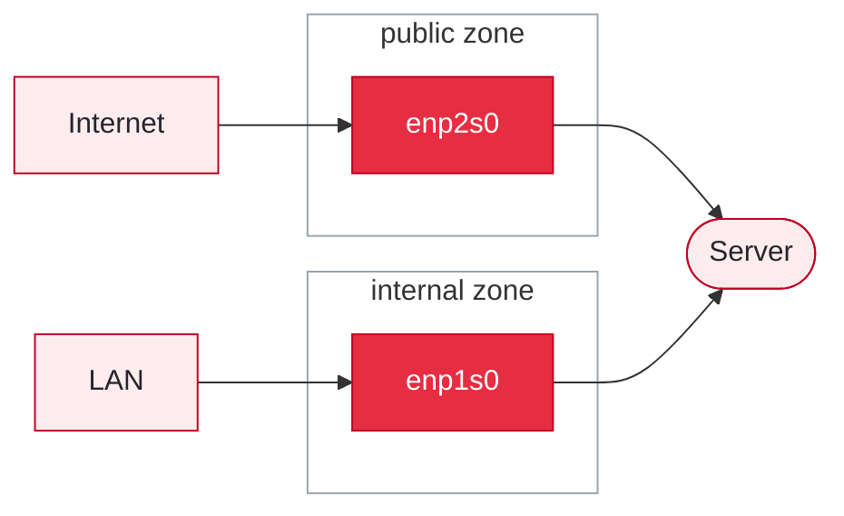

# Firewalls

## Who can connect, and how

---
listSpacing: padded
---

# What a Firewall Does

Every firewall asks one question about a connection: <SuccessText>allow it</SuccessText>, or <DangerText>refuse it</DangerText>

- The answer comes from a list of rules
- A rule matches on what the connection looks like
  - Where it came <AccentText>from</AccentText>
  - Where it is going <AccentText>to</AccentText>
  - Which <AccentText>port</AccentText> it is asking for

<!--
Keep this abstract for one slide. The next two slides show the same idea from the two places a firewall runs, and the difference between them is the whole reason the table after that looks the way it does.
-->

---
layout: two-cols-header
leftWidth: 45
---

# A Network Firewall

::left::

Stands between two networks and asks

**<AccentText>Can this network talk to that network?</AccentText>**

Rules have to name both ends

Each direction needs its own rule

```text [Two rules, one per direction]
FROM             TO              PORT   ACTION
10.0.0.0/8       172.16.0.0/16   3306   allow
172.16.0.0/16    10.0.0.0/8      any    deny
```

::right::



---
layout: two-cols-header
leftWidth: 65
---

# A Server Firewall

Stands between the network and this host and asks:

**<AccentText>Can this network talk to me?</AccentText>**

::left::

Only sees traffic addressed to itself

```text [Host: 10.0.0.6]
FROM          TO    PORT    ACTION
10.0.0.0/8    me    3306    allow
```

```text [Host: 10.0.0.5]
FROM             TO    PORT    ACTION
172.16.0.0/16    me    443     allow
```

::right::



---

# Firewall

| Source Network     | Ports      | Allowed / Blocked                  |
|--------------------|------------|------------------------------------|
| `192.168.1.0/24`   | 20, 21, 22 | <SuccessText>Allowed</SuccessText> |
| `100.200.225.0/22` | 80, 443    | <SuccessText>Allowed</SuccessText> |
| `100.200.225.18`   | 80, 443    | <SuccessText>Allowed</SuccessText> |
| Any                | 25, 587    | <SuccessText>Allowed</SuccessText> |
| **Any**            | **Any**    | <DangerText>Blocked</DangerText>   |

<Callout title="Deny by Default">

Anything not specifically allowed is denied

</Callout>

<!--
Default deny is the idea students carry into the zone material. Every zone but trusted works this way: a short allow list, and everything else rejected.

Port 25,587 = SMTP
-->

---
horizontal: center
---

# Why Multiple Firewalls?

If we have network Firewalls why do we also need firewalls on the server?




Provide <AccentText>defense in depth</AccentText> and prevent <AccentText>lateral movement</AccentText>

---

# Ports on the Back of the Server

One server, two network interfaces, and each one can sit in a different zone



Photograph by [ChrisDag](https://www.flickr.com/photos/8558461@N08/4524625686), [CC BY 2.0](https://creativecommons.org/licenses/by/2.0/), via Flickr

---
layout: two-cols-header
leftWidth: 60
---

# Traffic Flow

::left::

- Traffic arrives on an <AccentText>interface</AccentText>
    - enp1s0
    - enp2s0
- The interface belongs to a <AccentText>zone</AccentText>
    - public
    - internal
- The zone decides what is <AccentText>allowed</AccentText>
    - 22
    - 80 and 443
    - 3306
::right::

| Zone       | Allowed      |
|------------|--------------|
| `public`   | 443          |
| `internal` | 22, 80, 3306 |

<div class="flex justify-center">



</div>

---
listSpacing: padded
---

# RHEL Firewall Components

- `firewalld`
  - The dynamic manager you configure, and the "front end"
- `nftables`
  - Classifies packets and applies the rules
- `netfilter`
  - The kernel framework that filters, translates, and forwards packets

