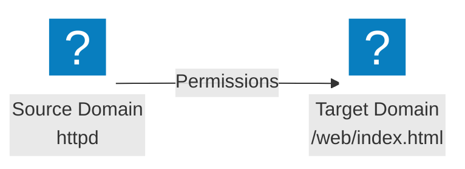
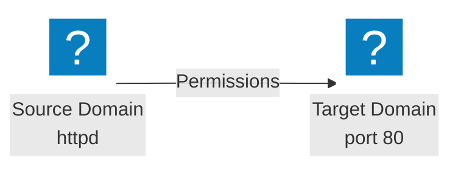

# SELinux Port Labels

## Ports are targets too

---
layout: two-cols-header
leftWidth: 42
vertical: center
horizontal: center
---

# Guess Who's Back, Back Again. SELinux

Last week the `target` was always a file, it can also be a port

::left::

- Source Domain
    - Usually a process
- Target Domain
    - A file or directory
    - <AccentText>Or a port</AccentText>

::right::





::bottom::

SELinux Policy allows the `httpd` process to access ports `80` and `443`

---
listSpacing: padded
---

# SELinux Ports

- SELinux controls what a process is allowed to reach
- A port is a target, the same way a file is
- A target carries a label, and the policy says which labels `httpd` may bind to

<TerminalWindow title="student@servera:~">

```bash-session
student@servera:~$ sudo semanage port -l | grep ^http
http_cache_port_t              tcp      8080, 8118, 8123, 10001-10010
http_cache_port_t              udp      3130
http_port_t                    tcp      80, 81, 443, 488, 8008, 8009, 8443, 9000
```

</TerminalWindow>

8888 is not on the `http_port_t` line, so `httpd` was refused when it asked for it

---
listSpacing: padded
---

# Labeling a Port

<TextExplainer
  :lines="[
    'semanage port -a -t http_port_t -p tcp 8888',
  ]"
  :steps="[
    { line: 1, text: 'semanage port', explanation: 'Manage SELinux Ports' },
    { line: 1, text: '-a', explanation: 'Add a port to the policy' },
    { line: 1, text: '-t http_port_t', explanation: 'The label to give it, from the list httpd may bind to' },
    { line: 1, text: '-p tcp', explanation: 'The protocol' },
    { line: 1, text: '8888', explanation: 'The port itself' },
  ]"
/>

- It applies at once, with no `restorecon`, because no file is being relabeled
- `-m` changes a label that already exists, and `-d` removes one you added
- `semanage port -l -C` lists your changes alone

---
layout: exercise
---

# Configure SELinux to Allow HTTP on 8888

::goal::

Label port 8888 so `httpd` can bind to it, then reach the page from `workstation`

::environment::

**Host:** `servera`, from `workstation`

**Prerequisite exercise:** Configure Apache to Listen on 8888

::workflow::

1. Inspect the ports `httpd` is allowed to bind to
2. Label 8888 with `http_port_t`
3. Start `httpd` and request the page from `workstation`
4. Put `servera` back the way you found it

---
layout: exercise
variant: recording
---

<script setup>
import castUrl from "./exercises/configure-selinux-for-http-on-8888-exercise.cast?url";
</script>

# Configure SELinux to Allow HTTP on 8888

::recording::

<AsciinemaPlayer
    :src="castUrl"
    label="Screen recording of the instructor listing the http port labels with semanage, labeling tcp port 8888 as http_port_t, starting httpd and loading the page on port 8888 from workstation, then removing the port label, firewall rules, Listen change, and packages to put servera back the way it started."
/>

::resources::

<a href="../resources/configure-selinux-for-http-on-8888-exercise.html" target="_blank" rel="noopener noreferrer" aria-label="Read the written Configure SELinux to Allow HTTP on 8888 exercise in a new tab">Written exercise</a>
