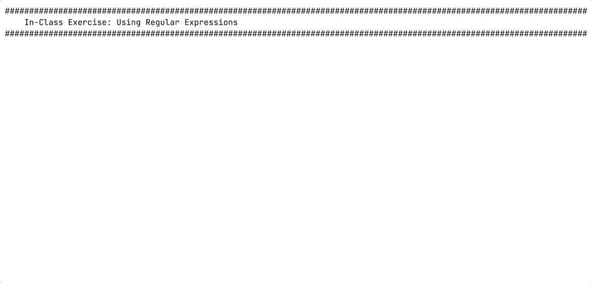

::kicker::

Adwaita-inspired light theme

::default::

# IT-230 Theme Gallery

A classroom-readable Linux visual language built for presentations, not a
simulated desktop application.

---

# Ordinary technical content

The default slide treatment keeps familiar Markdown clear without requiring
custom Vue markup.

- Use descriptive headings and short, parallel list items.
- Keep commands copyable, such as `systemctl status sshd`.
- Use an accessible [descriptive link](https://example.com), not color alone.

> Prefer the smallest command that proves the system state you need to inspect.

<p class="h3">Search unit files with <code>-k</code></p>

Inline code carries no background or border, in prose or in a heading; accent
color and the monospace face are the only emphasis.

---

# Even vertical content

**Observe:** Keep the slide title anchored while the body uses the available
height.

**Decide:** Treat each top-level Markdown block after the title as one item in
the distribution.

<Callout>

The default layout distributes body items evenly unless another vertical alignment is selected.

</Callout>

---
vertical: center
listSpacing: padded
---

# Centered content with a padded list

- Keep the list together as one centered body block.
- Add deliberate space between its top-level items.
- Leave nested lists at the theme's normal spacing.

---
layout: two-cols-header
horizontal: center
leftWidth: 60
vertical: center
listSpacing: padded
---

# Centered 60/40 comparison columns

::left::

## Inspect

- Observe the current state.
- Gather the evidence you need.

::right::

## Change

- Make one deliberate change.
- Verify the resulting state.

---
layout: two-cols-header
listSpacing: padded
vertical: evenly
---

# Text with a centered image

::left::

- Arrange the text independently of the image.
- Add space between top-level list items.
- Let the image fit its available area.

::right::


---
layout: section
---

::kicker::

Section 02 · Service management

::default::

# Inspect before changing state

Read the current unit status, identify the desired state, and make one
deliberate change.

---
layout: exercise
---

# Ranges and Quantifiers

::goal::

Search realistic data with regular-expression ranges and quantifiers

::environment::

**Host:** `servera`

**Prerequisite exercise:** Searching Log Files with `grep`

::workflow::

1. Seed and inspect failed-login entries
2. Extract and count the matching IP addresses
3. Create a sample directory tree
4. Match numbered site directories
5. Compare basic and extended expressions
6. Refine the expression with a quantified range
7. Verify the final matches
8. Protect a wildcard from pathname expansion
9. Compare variable handling in single and double quotes
10. Create a directory whose name contains spaces

---
layout: exercise
variant: recording
---

# Ranges and Quantifiers

::recording::



::resources::

<a href="https://asciinema.org/a/BLokJ1ZIVOfAMXA6" target="_blank" rel="noopener noreferrer" aria-label="Watch the Asciinema recording in a new tab">Asciinema recording</a><a href="https://example.com/written-exercise" target="_blank" rel="noopener noreferrer" aria-label="Open the written exercise in a new tab">Written exercise</a>

---

# Commands and terminal output

Fenced code and terminal commands share accessible Bash syntax colors on light
surfaces; prompts remain distinct and output stays neutral. `rows` reserves the
final transcript height so a growing sequence does not move the frame.

```bash
systemctl status sshd --no-pager
sudo systemctl enable --now sshd
```

<TerminalWindow title="student@lab:~" :rows="7">

````md magic-move {lines:true}
```bash-session
student@lab:~$
```
```bash-session
student@lab:~$ cd /etc/ssh
student@lab:/etc/ssh$ printf '%s\n' '# [ ] $HOME'
# [ ] $HOME
student@lab:/etc/ssh$
```
```bash-session {1|2-3|4-7|all}
student@lab:~$ cd /etc/ssh
student@lab:/etc/ssh$ printf '%s\n' '# [ ] $HOME'
# [ ] $HOME
student@lab:/etc/ssh$ sudo systemctl enable --now sshd
student@lab:/etc/ssh$ sudo -i
root@lab:~# systemctl is-active sshd
active
```
````

</TerminalWindow>

---
vertical: center
---

# Naming the file a snippet belongs in

A fence may carry a title after the language. The theme attaches it to the top
of the block as a compact header, so the file name and its contents read as one
object.

```bash [~/.bashrc]
PS1='\u@\h:\W\$ '
PATH=$PATH:~/scripts
```

Leave the title off for a command a student types at a prompt.

---
layout: center
---

# Explain text of any shape

<TextExplainer
  :lines="[
    'student@workstation:~$ crontab -l',
    '*/2 * * * * /usr/local/bin/collect_stats',
  ]"
  :steps="[
    { line: 2, text: '*/2', explanation: 'Minutes, every second minute' },
    { line: 2, text: '*', occurrence: 2, explanation: 'Hours, 0 through 23' },
    { line: 2, text: '*', occurrence: 5, explanation: 'Day of week, 0 through 7' },
    { line: 2, text: '/usr/local/bin/collect_stats', explanation: 'The command to run' },
  ]"
/>

Every line renders the same. Only the marked range is embellished, and `line`
says which line a step searches.

---

# Semantic emphasis and labeled callouts

<p>
  Semantic text:
  <AccentText>accent emphasis</AccentText> ·
  <SuccessText>successful state</SuccessText> ·
  <WarningText>warning state</WarningText> ·
  <DangerText>dangerous state</DangerText> ·
  <InfoText>information</InfoText>
</p>

<p>
  Variants:
  <AccentText normal>normal weight</AccentText>,
  <AccentText italic>italic emphasis</AccentText>, and
  <AccentText code>monospace text</AccentText>.
</p>

<div class="grid grid-cols-2 gap-4">

<Callout type="accent">

Read the unit file before creating an override.

</Callout>

<Callout type="success">

Use <code>--no-pager</code> during a projected demonstration.

</Callout>

<Callout type="warning">

Confirm the service name before enabling it at boot.

</Callout>

<Callout type="danger" title="Stop and verify">

Do not interrupt an active remote-access path.

</Callout>

</div>

---

# Tables and hierarchy

| Question         | Command                     | Expected evidence   |
| ---------------- | --------------------------- | ------------------- |
| Is it running?   | `systemctl is-active sshd`  | *active*            |
| Starts at boot?  | `systemctl is-enabled sshd` | **enabled**         |
| Recent messages? | `journalctl -u sshd -n 20`  | Timestamped entries |

### Visual rule

Use spacing, weight, labels, and borders alongside color so the slide remains
understandable when colors are difficult to distinguish.
